# 第 1 章 学习方法

## 1.1 参考资料

**《RM0008参考手册_STM32F10x_10_zh.pdf》**

**《RM0008ReferenceManual_STM32F10x_21_en.pdf》** 

 是 ST 官方发布的通用参考资料，重点介绍 STM32 内部资源及使用，寄存器描述等，没有实例，也没有对 Cortex-M3 内核架构进行介绍

**《DS5319数据手册_STM32F103_10_zh.pdf》** 

**《DS5319Datasheet_STM32F103_19_en.pdf》** 

 是 ST 官方发布的对 STM32 芯片的数据手册

**《ARMCortexM3权威指南\_JosephYiu_宋岩译》** 

 是专门介绍 Cortex-M3 内核架构的参考资料，有简短的实例，但没有专门针对 STM32 的介绍

## 1.2 资料查找

1、ST 官方

[STM32嵌入式软件: 相关PDF文档](https://www.st.com.cn/zh/embedded-software/stm32-embedded-software/documentation.html) 工具与软件——嵌入式软件——STM32 微控制器软件——文件

[STMCU中文官网](https://www.stmcu.com.cn/design_resource) 设计资源

2、正点原子

 [正点原子资料下载中心 1.0.0 文档](http://www.openedv.com/docs/index.html)

 [OpenEdv-开源电子网-正点原子论坛](http://www.openedv.com/forum.php)

 [提问的智慧](http://www.openedv.com/thread-7245-1-1.html) 提高提问质量，不浪费请教者、解答者双方的精力

## 1.3 编写规范

本笔记通过试验例程来详细学习 STM32 的所有功能和外设，按难易程度以及知识结构进行学习，建议按顺序学习，或者按章节复习

各章节在结构上有一定相似，一般分为 4 个部分，如下：

 1、外设功能介绍

 2、硬件设计

 3、程序设计

 4、下载验证

 外设功能介绍，介绍该章节所使用外设的功能、框图、寄存器等，学习该外设的原理

 硬件设计，包括试验例程的功能说明、硬件资源、原理图连接方式，从而知道要做什么？需要用到那些 IO 口？是怎么连线的？

 程序设计，一般包括：驱动介绍、配置步骤、程序流程图、关键代码分析、main 函数讲解

 下载验证，是实践环节，在完成程序设计后，如何下载并验证试验例程是否正确？

## 1.4 代码规范

详细的代码规范说明文档，见《正点原子 嵌入式单片机 C 代码规范与风格 V1.1.pdf》

总结几个规范的关键点：

 1、所有函数/变量名非特殊情况，一般使用小写字母

 2、注释风格使用 doxgen 风格，除屏蔽外，一律使用 /\* \*/ 方式进行注释

 3、TAB 键统一使用 4 个空格对齐，不使用默认的方式

 4、每两个函数之间，一般有且只有一个空行

 5、相对独立的程序块之间，使用一个空行隔开

 6、全局变量命名一般用 g* 开头，全局指针命名一般用 p* 开头

 7、if、 for、 while、 do、 case、 switch、 default 等语句单独占一行，一般无论有多少行执行语句，都要用加括号：{}

## 1.5 试验例程资源说明

本笔记以 **标准库、HAL 库** 版本的例程学习

==（写完再来统计有多少个例程）==

## 1.6 总结建议

**1、合适的开发板（搭配仿真器）**

 任何试验，都需要验证，最好的验证方法是在开发板上实际跑起来，然后通过仿真器仿真调试，查看具体的执行过程，方便查找 bug

**2、两本参考手册**

 **《RM0008参考手册_STM32F10x_10_zh.pdf》**

 **《ARMCortexM3权威指南\_JosephYiu_宋岩译》**

 多了解一些底层的东西，不要只会使用库，否则一旦遇到问题，或者换个芯片，就不会处理了

**3、戒骄戒躁，勤思敏行**

最后，C 语言是学习 STM32 的必备知识，好好学习 C 语言基础

# 第 2 章 STM32 简介

STM32 是 ST 公司基于 ARM Cortex-M 内核开发的 32 位微控制器，STM32 功能强大、性能优异、片上资源丰富、功耗低，是一款经典的嵌入式微控制器，常应用在嵌入式领域，如智能车、无人机、机器人、无线通信、物联网、工业控制、娱乐电子产品等

ARM 既指 ARM 公司，也指 ARM 处理器内核，是全球领先的半导体知识产权（IP）提供商，全世界超过 95%的智能手机和平板电脑都采用 ARM 架构，ARM 公司设计 ARM 内核，半导体厂商完善内核周边电路并生产芯片

## 2.1 STM32 资源简介

详细的内部资源介绍，见**《DS5319数据手册_STM32F103_10_zh.pdf》**

STM32F103C8T6 内部资源：

|            |           |            |     |            |     |
| ---------- | --------- | ---------- | --- | ---------- | --- |
| 内核       | Cortex M3 | 基本定时器 | /   | USART/UART | 3   |
| 主频       | 72Mhz     | 通用定时器 | 3   | CAN        | 1   |
| FLASH      | 64KB      | 高级定时器 | 1   | SDIO       |     |
| SRAM       | 20KB      | 12 位 ADC  | 2   | FSMC       |     |
| 封装       | LQFP48    | ADC 通道数 | 10  | DMA        |     |
| IO 数量    | 37        | 12 位 DAC  | /   | RTC        |     |
| 工作电压   | 3.3V      | SPI        | 2   | IIC        | 2   |
| USB Device |           | USB OTG    | 1   | Ethernet   |     |

STM32F407IGT6 内部资源：

|            |           |            |     |            |        |
| ---------- | --------- | ---------- | --- | ---------- | ------ |
| 内核       | Cortex M4 | 基本定时器 | 2   | USART/UART | 6      |
| 主频       | 168Mhz    | 通用定时器 | 10  | CAN        | 2      |
| FLASH      | 1024KB    | 高级定时器 | 2   | SDIO       | 1      |
| SRAM       | 192KB     | 12 位 ADC  | 3   | FSMC       | 1      |
| 封装       | LQFP176   | ADC 通道数 | 18  | DMA        | 2      |
| IO 数量    | 140       | 12 位 DAC  | 2   | RTC        | 1      |
| 工作电压   | 3.3V      | SPI        | 3   | IIC        | 3      |
| USB Device | 1         | USB OTG    | 1   | Ethernet   | 10/100 |

片上外设：

| **英文缩写** | **名称**           | **英文缩写** | **名称**           |
| ------------ | ------------------ | ------------ | ------------------ |
| NVIC         | 嵌套向量中断控制器 | CAN          | CAN 通信           |
| SysTick      | 系统滴答定时器     | USB          | USB 通信           |
| RCC          | 复位和时钟控制     | RTC          | 实时时钟           |
| GPIO         | 通用 IO 口         | CRC          | CRC 校验           |
| AFIO         | 复用 IO 口         | PWR          | 电源控制           |
| EXTI         | 外部中断           | BKP          | 备份寄存器         |
| TIM          | 定时器             | IWDG         | 独立看门狗         |
| ADC          | 模数转换器         | WWDG         | 窗口看门狗         |
| DMA          | 直接内存访问       | DAC          | 数模转换器         |
| USART        | 同步/异步串口通信  | SDIO         | SD 卡接口          |
| I2C          | I2C 通信           | FSMC         | 可变静态存储控制器 |
| SPI          | SPI 通信           | USB OTG      | USB 主机接口       |

## 2.2 STM32 设计选型

### 2.2.1 STM32 系列

[STM32 Microcontrollers (MCUs) - 意法半导体STMicroelectronics](https://www.st.com.cn/zh/microcontrollers-microprocessors/stm32-32-bit-arm-cortex-mcus.html)

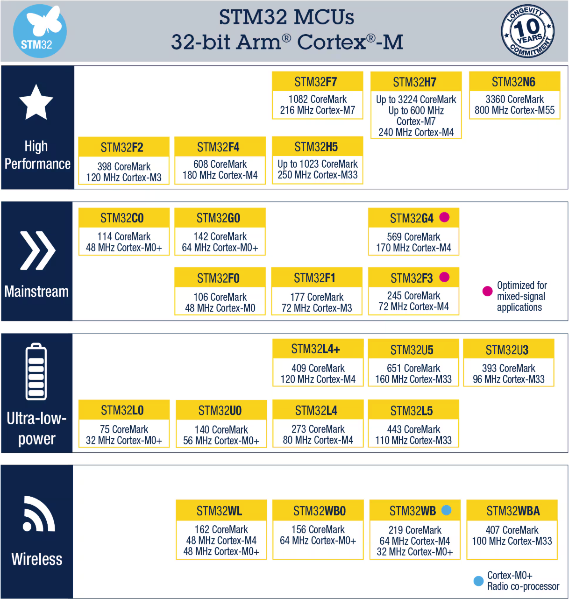 

STM32 主要分为两大块，MCU 和 MPU，MCU 是常见的 STM32 微控制器，不能跑 Linux，而 MPU 是 19 年才推出的微处理器，可以跑 Linux，可以根据自己的实际需要选择合适的 STM32 来设计

由于 STM32 系列有很好的兼容性，只要熟练掌握其中一款 MCU，就可很方便的学会并使用其他系列的 MCU

### 2.2.2 STM32 命名

STM32 命名规则（摘自 STM32 产品选型手册）


STM32 的产品名字里包含：家族、类别、特定功能、引脚数、闪存容量、封装、温度范围等重要信息

以 STM32F103C8T6，从命名可知：

| 描述     | 型号  | 说明                |
| -------- | ----- | ------------------- |
| 家族     | STM32 | ST 公司 32 位 MCU   |
| 产品类别 | F     | 基础型              |
| 特定功能 | 103   | 主流入门级          |
| 引脚数   | C     | 48&49 引脚          |
| 闪存容量 | 8     | 64KB                |
| 封装     | T     | QFP 封装            |
| 温度范围 | 6     | -40 ~ +85℃ (工业级) |

### 2.2.3 STM32 选型

**由高到低**原则：不能评估项目所需性能时，优先考虑选择高性能 MCU 进行开发，完成关键性能代码开发验证，如果满足使用要求，则可以降档，如从 H7→F7→F4→F1；如果不满足要求，则可以升档

**由大到小**原则：不能评估项目所需 FLASH 大小、 SRAM 大小、 GPIO 数量、定时器等资源需求时，优先选择容量较大资源多的 MCU 进行开发，完成大部分功能后，可对项目所需资源定论，再根据实际情况进行降档或者升档选择

通过此方法找到最佳性价比的 MCU

### 2.2.4 STM32 设计

在选择 MCU 型号后，需要先设计原理图，再画 PCB、打样、焊接、调试等步骤

任何 MCU 部分的原理图设计，应遵循： **最小系统 + IO 分配** 的设计原则

《DS5319数据手册_STM32F103_10_zh.pdf》P16、P17

 IO 的定义和说明，是设计原理图的基础

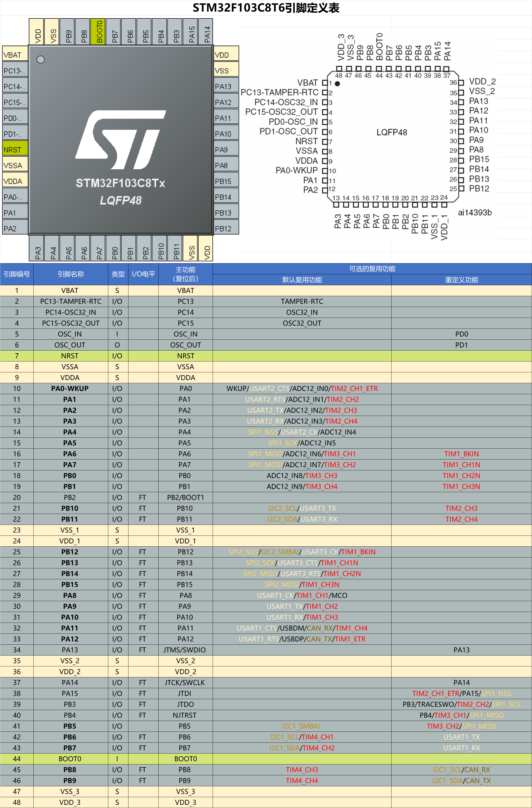

#### 1、最小系统电路

最小系统电路：保证 MCU 正常运行的最低要求电路，一般包括：电源、复位、启动配置、晶振、下载调试等电路

| 类型 | 引脚名称           | 说明                                                                                                                     |
| ---- | ------------------ | ------------------------------------------------------------------------------------------------------------------------ |
| 电源 | VDD/VSS            | 电源正/负引脚，给 STM32 供电                                                                                             |
|      | VDDA/VSSA          | 模拟部分电源正/负引脚，给 STM32 内部模拟部分供电                                                                         |
|      | VREF+/VREF-        | 参考电压正/负引脚，给 STM32 内部 ADC/DAC 提供参考电压<br />100 引脚及以上的 MCU 型号才有                                 |
|      | VBAT               | RTC&后备区域 供电引脚，给 RTC 和后备区域供电<br />一般 VBAT 引脚接电池，用于断电维持 RTC 工作，如不需要，直接接 VDD 即可 |
| 复位 | NRST               | 复位引脚，低电平复位，用于复位 STM32                                                                                     |
| 启动 | BOOT0/BOOT1        | 启动选择引脚，一般各接一个下拉电阻即可，其他启动配置说明详见后续分析                                                     |
| 晶振 | OSC_IN/OSC_OUT     | 外部 HSE 晶振引脚，用于给 STM32 提供高精度系统时钟，若使用内部 HSI 能满足要求，该引脚可不接晶振                          |
|      | OSC32_IN/OSC32_OUT | 外部 LSE 晶振引脚，用于给 STM32 内部 RTC 提供时钟，若使用内部 LSI 能满足要求，该引脚可不接晶振                           |
| 调试 | SWCLK/SWDIO        | SWD 调试引脚，用于调试 STM32 程序，且省 IO 口，同时 STM32 还支持 JTAG 调试，不推荐                                       |

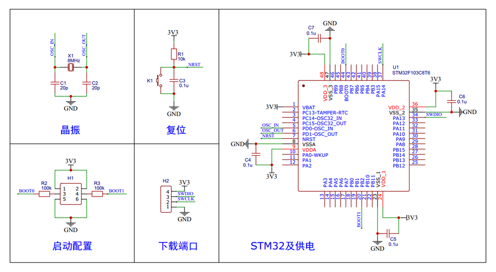

#### 2、IO 分配

在完成最小系统电路设计后，根据项目需要对 MCU 的 IO 口进行分配，连接需要的器件，从而实现整体功能

应遵循：**先分配特定外设 IO 口，再分配通用 IO 口，最后微调** 的原则

| 分配     | 外设        | 说明                                                                                                                                              |
| -------- | ----------- | ------------------------------------------------------------------------------------------------------------------------------------------------- |
| 特定外设 | IIC         | 一般用 2 根线，引脚定义有 I2C_SCL、I2C_SDA 复用功能的 IO 都可选用                                                                                 |
|          | SPI         | 用 4 根线，一般 SPI_CS 使用通用 IO，方便挂多个 SPI 器件，引脚定义有 SPI_MOSI/MISO/SCK 复用功能的 IO 都可选用                                      |
|          | TIM         | 印脚定义有 TIM_CHx/ETR/xN/BKIN 复用功能的 IO 都可根据需要选择                                                                                     |
|          | USART，UART | USART 有 USART_TX/RX/CTS/RTS/CK 信号，UART 仅有 USART_TX/RX 两个信号，一般用到 2 根线，引脚定义有 U(S)ART_TX 和 U(S)ART_RX 复用功能的 IO 都可选用 |
|          | USB         | 用 2 根线，引脚定义有 USB_DP 和 USB_DM 复用功能的 IO 都可选用                                                                                     |
|          | CAN         | 用 2 根线，引脚定义有 CAN_RX 和 CAN_TX 复用功能的 IO 都可选用                                                                                     |
|          | ADC         | 引脚定义有 ADC_IN0~ADC_IN15 复用功能的 IO 都可根据需要选择                                                                                        |
|          | DAC         | 固定为：DAC_OUT1 使用 PA4、DAC_OUT2 使用 PA5                                                                                                      |
|          | SDIO        | 一般用 6 根线，引脚定义有 SDIO_D0/1/2/3/SCK/CMD 复用功能的 IO 都可选用                                                                            |
|          | FSMC        | 引脚定义有 FSMC_D0 ~ 15/A0 ~ 15/NBL0 ~ 1/NE1 ~ 4/NCE2 ~ 3/NOE/NWE/NWAIT/CLK 复用功能的 IO 都可选用                                                |
| 通用     | GPIO        | 在完成特定外设的 IO 分配后，就可进行 GPIO 分配，比如将按键、LED、蜂鸣器等仅需高低电平读取/输出的外设连接到空闲的普通 GPIO 即可                    |
| 微调     | IO          | 1、当 IO 不够用时，通用 GPIO 和特定外设可能要共用 IO；2、为方便布线，可能要调整某些 IO 的位置。<br />应尽可能多的同时使用所有功能，尽可能方便布线 |

# 第 3 章 开发环境搭建

集成开发环境：

 MDK (RealView MDK) ，Keil (被ARM 公司收购) 公司的集成开发环境

仿真器：

 DAP (CMSIS-DAP Debugger)，ARM 公司的开源仿真器，可支持 STM32 仿真调试，带虚拟串口功能。在 MDK 下免驱

 STLINK，ST 公司的仿真器，支持 STM32 和 STM8 仿真调试，目前最常用的是 STLINK V2

 JLINK，Segger 公司的仿真器，支持 STM32 仿真调试

串口助手：

XCOM，正点原子开发的串口助手

## 3.1 安装 Keil5 MDK

官网：[Keil Product Downloads](https://www.keil.com/download/product/) (外网慢不推荐)

1. 解压缩`Keil5 MDK.zip`
2. 双击`MDK524a.EXE`
3. 点击`Next` 、勾选`I agree...` 、点击`Next`
4. 选择安装目录`Core:` `D:\_EmbeddedSystemTool\Keil_v5` [目录路径为英文]、点击`Next`
5. "Customer Information"随便填、点击`Next`
6. 弹出安装`InstallULINK(调试器)`
7. 取消`Show Release Notes` 、点击`Finish`
8. 安装完成，弹出`Pack Installer`窗口，关闭后面按需安装

> 因为 C51 和 MDK 安装在同一目录下，新建项目时，`Device`选择`Software Packs`为 MDK；选择`Legacy Device Database [no RTE]`为 C51

9. 以管理权限运行 Keil5 软件
10. 点击 `File\License Management` ，复制`CID` 的值
11. 打开解压缩文件夹`Keil5 MDK` 解压`keygen_new2032.zip`，打开``keygen_new2032.exe`
12. 粘贴`CID` 的值，`Target`选择`ARM`，点击`Generate`，复制生成的序列码，点击`Exit`
13. 粘贴进`New License ID Code`，点击`Add LIC`，提示"LIC Added Sucessfully"
14. 注册成功，可使用到 2032 年

## 3.2 安装 STLINK 驱动

1. 插入 STLINK
2. 在`设备管理器\其他设备`中，看到`STM32 STLink`，带感叹号是指未安装驱动程序
3. 驱动程序包在 keil 安装目录下，`Keil_v5\ARM\STLink\USBDriver` dpinst_amd64.exe [64 位程序包]
4. 双击安装
5. `通用串行总线设备`下有`STM32 STLink`，安装成功

## 3.3 安装 USB 转串口驱动

1. 芯片是`CH340`，插入 USB
2. 在`设备管理器\其他设备`中，看到`USB Serial`，带感叹号是指未安装驱动程序
3. 双击`USB转串口CH340驱动\CH341SER.EXE` ，点击`安装`
4. 出现`驱动安装成功！`，`端口(COM 和 LPT)`下有`USB-SERIAL CH340(COM3)`，安装成功

## 3.4 MDK5 使用技巧

### 3.4.1 文本美化

Encoding：设置编辑器代码字体：UTF-8、GB2312，更好的支持中文

View White Space：设置编辑器的空格可见，所有空格用“.”替代，TAB 缩进用“→”替代。

Tab size：设置 TAB 键的大小为 4 个字符，同时 Insert spaces for tabs：TAB 缩进使用空格替代。，避免不同软件的 TAB 键大小不一导致代码不对齐的问题。


### 3.4.2 代码字体大小

在代码区直接按住：Ctrl+鼠标滚轮，进行放大或缩小

### 3.4.3 语法检测、代码提示

Struct/Class Members：结构体/类成员提示
Function Parameters：函数参数提示
Symbols after xx Characters：输入 xx 个字符后进行代码提示（如函数名、结构体名、变量名），默认为 3 字符开始提示
ENTER/TAB as fill-up character：使用回车/TAB 键填充字符
Dynamic Syntax Checking：开启动态语法检测，若编写的代码存在语法错误的时候，在对应行前面出现"X"图标，若出现警告，则在对应行前出现"！"图标，将鼠标光标放图标上，则提示产生错误/警告的原因（有时会误报，如 sys.c，只要编译通过 0 错误 0 警告，语法误报可忽略）

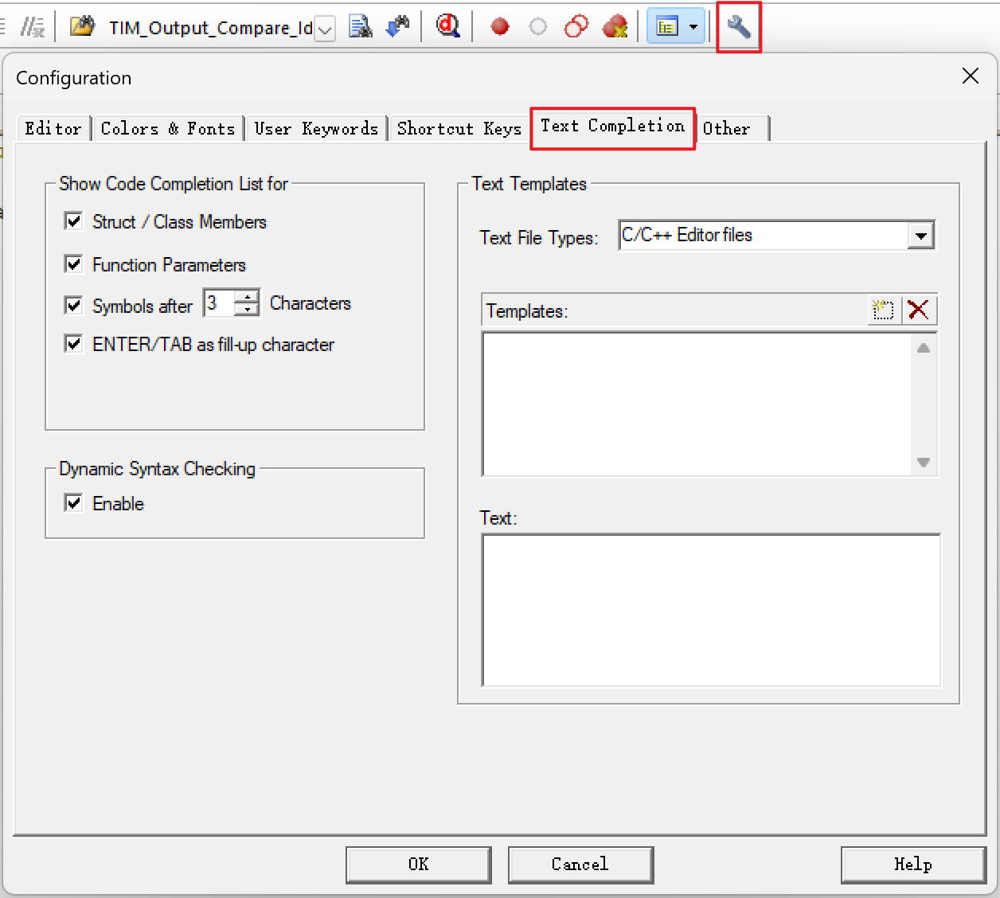

### 3.4.4 TAB 键的妙用

空位：每按一下移空几个字符位
块操作：可 让 一片代码整体右移固定的几个位，也可通过 SHIFT+TAB 键整体左移固定的几个位。
选中几行代码，按 TAB 键，整块代码可一起右移几个字符

### 3.4.5 快速定位函数/变量被定义的地方

将鼠标光标放在函数/变量 xxx 上，右键，点击 Go to Definition Of 'xxx' (需设置 Options for Target —— Output —— Browse Information，再编译，才能定位)

很多时候用 Go to Definition 看完函数/变量的定义后，又想返回之前的代码继续看，可以通过 IDE 上的"←"按钮（ Back to previous position）快速的返回之前的位置

### 3.4.6 快速注释、快速取消注释

选中需注释的代码区，右键，选择 Advance——Comment Selection
选中需取消注释的代码区，右键，选择 Advance——Uncomment Selection

### 3.4.7 快速打开头文件

将鼠标光标放在需打开的引用头文件上，右键，Open Document "XXX"

### 3.4.8 查找替换

Ctrl+F 或 Ctrl+H
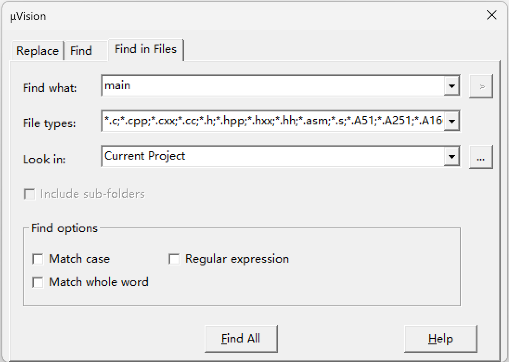

### 3.4.9 跨文件查找

双击需查找的函数/变量名，Ctrl+F，选择 Find in Files，限定搜索范围，点击 Find All，会列出所在位置

### 3.4.10 Templates 编程模板

将常用的代码设置成模板，方便直接调用


.h 头文件 模板

**注意：** `__|_H_` 中 `|` 表示鼠标光标默认停在此处

```c
#ifndef __|_H__
#define

;

#endif

```

include 调用函数 模板

```c
#include "|.h"
```

/\* \*/ 注释 模板

```c
/**
  *@brief |
  *@param
  *@retval
  */
```

main 主函数 模板

```c
void main(){
	while(1){
		|
	}
}
```

## 3.5 硬件

淘宝：STM32 单片机开发板 江协科技

订单号：4003241906851083411

 资料下载 https://jiangxiekeji.com/download.html

 stlink 和 32 的接线教程 https://v.qq.com/x/page/d3543hcjyka.html?url_from=share

 keil5 软件安装方法 https://v.qq.com/x/page/i3513d5jcb9.html

核心板与最小系统板的区别

核心板

一般指一块仅包含 STM32 芯片、电源电路、时钟电路、复位电路 等最基本的电路板。一般不包含外设模块，如 LCD 屏、WiFi 模块等。可让用户更加灵活地选择和添加所需地外设模块，利于用户学习 STM32 芯片的基本功能和使用方法

最小系统板

指一块包含 STM32 芯片和一些基本外设模块，如 LED 灯、按键、串口等的电路板。集成了常用的外设模块，可直接用于一些简单的项目开发

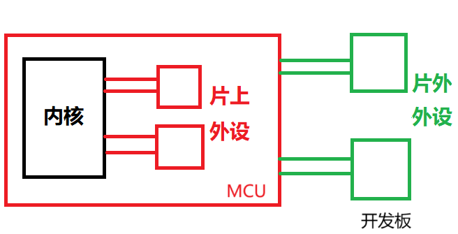 

STM32 电源名称缩写

| 极性     | 通常 | STM32 |
| -------- | ---- | ----- |
| 电源正极 | Vcc  | Vdd   |
| 接地     | GND  | Vss   |

为什么 STM32 电源的缩写会与通常习惯不同，这与 MOS 管的结构有关

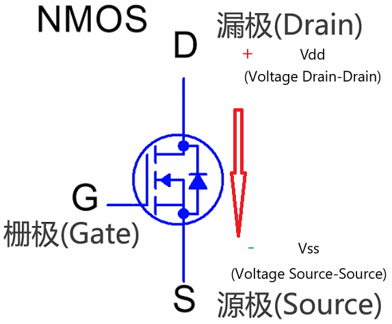 

# 第 4 章 新建工程

标准外设库 Std、HAL 库、LL 库的区别

标准外设库 Std ：Standard Peripheral Libraries

HAL 库 ：Hardware Abstraction Layer 硬件抽象层

LL 库 ：Low Layer

 **使用HAL库、标准库按照以下模板建立的工程，不同工程用不同的MDK-ARM文件来构建，但共用一个 Drivers 文件，外发时只需发布 MDK-ARM 文件 (前提是已有一个完整的工程文件)** 

 **使用STM32CubeMX或者STM32CubeIDE进行开发时，因可选择“只复制必须的库到工程目录中”，且配置好外设功能后自动生成代码，所以可针对不同工程建立完整的工程框架，而不会造成硬盘空间的过多浪费** 

## 4.1 新建标准库工程

### 4.1.1 准备

[STM32 标准外设软件库 - 意法半导体 STMicroelectronics](https://www.st.com.cn/zh/embedded-software/stm32-standard-peripheral-libraries.html)

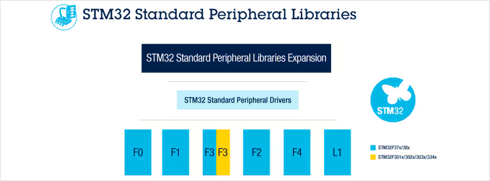

1、STM32Cube 官方固件包：STM32F10x_StdPeriph_Lib_V3.5.0

2、开发环境：MDK5 安装、仿真器及驱动、串口驱动

3、软件包：Keil.STM32F1xx_DFP.2.2.0

 安装软件包

 Keil5 以后将软件包独立出来，可按需安装。

 3.1、在线安装

 需联网在 keil 官网下载，下载网速很慢

 点击 Pack Installer，从官网自动获取支持的器件列表，没有自动获取的话，点击更新按钮

 STMicroelectronics、国产芯片厂商：GigaDevice、国产芯片厂商：MindMotion

 选中芯片厂商下的系列型号，在右边的 Device Specific 下，选择 Keil::STM32F1xx_DFP，点击其右边的 Install

 推荐使用离线安装方式安装

 3.2、离线安装

 在 Keil——魔术棒设置——Device 下，Software Pack

 Pack：当前安装的软件包

 URL：Arm Keil MDK 软件包官网地址 [Arm Keil | Devices](https://www.keil.arm.com/devices/?q=&vendor-search=&vendor=stmicroelectronics&sort_by=)

 选择芯片厂商，选择芯片内核，下载所需的芯片支持包

 双击`Keil.STM32F1xx_DFP.2.2.0.pack`

 目标路径自动选择为 Keil5 安装下的目录，点击`Next` ... 、点击`Finish`

### 4.1.2 步骤

1、新建工程文件夹，拷贝工程相关文件

- 在项目根目录中新建工程文件夹（可中文：描述实现什么功能）
- 新建 `MDK-ARM` 文件夹，用来储存 编译文件；再在其下新建`User` 文件夹，用来储存 用户代码
- 文件目录结构：参考 附件.STM32F103HAL 库文件目录解读.mmap

| 文件名                 | 描述                                                         | 是否必须 |
| ---------------------- | ------------------------------------------------------------ | -------- |
| startup_stm32f10x_md.s | 启动文件，引导进入 main 函数                                 | 是       |
| stm32f10x.h            | STM32F1 系列的顶层头文件                                     | 是       |
| system_stm32f10x.h'.c  | 系统初始化函数定义                                           | 是       |
| core_cm3.h'.c          | 内核寄存器定义，如 Systick、SCB                              | 是       |
| misc.h‘.c              | 外设对内核中的 NVIC 的访问函数                               | 是       |
| stm32f10x_ppp.h‘.c     | 片上外设的源码，ppp 表示任意外设                             | 用时是   |
| DebugConfig文件夹      | 存放调试设置信息文件（.dbgconf），不可删除！                 |          |
| Listings文件夹         | 存放编译过程产生的链接列表等文件                             |          |
| Objects文件夹          | 存放编译过程产生的调试信息、.hex、预览、.lib 文件等          |          |
| Project.uvprojx        | MDK-ARM工程文件                                              |          |
| main.c                 | 存放 main 函数，不一定放在该文件                             | 否       |
| stm32f10x_conf.h       | 用户配置文件，用于 HAL 库裁剪，配置晶振参数<br />配置是否使用“断言”编译选项，用于检查函数的输入参数 | 是       |
| stm32f10x_it.h'.c      | 存放用户中断服务函数，不一定放在该文件                       | 否       |
| keilkill.bat           | 清除编译生成的中间文件，减小工程文件大小，便于发布工程文件   | 否       |

- 拷贝相关文件：

​        将目录STM32F4xx_DSP_StdPeriph_Lib_V1.8.0下的Libraries拷贝进工程文件夹

​        CMSIS只保留Device、Include，其中CMSIS\Device\ST\STM32F4xx只保留Source、Include

​        对于STM32F1系列MCU，CMSIS只保留CM3，其中DeviceSupport\ST\STM32F10x删除Release_Notes.html文件

​        STM32F1xx_HAL_Driver只保留inc、src

2、新建工程框架

- 打开 MDK 软件，然后点击 Project——New uVision Project
- 工程命名和保存窗口，将工程文件保存到 `MDK-ARM` 文件夹中，名字为：Project.uvprojx
- 器件选择对话框（须安装对应的软件包），使用的 MCU 是 STM32F103C8T6，
  因此选择：Device：Software Packs；
  STMicroelectronics——STM32F1 Series——STM32F103——STM32F103C8Tx
- Manage Run-Time Environment 对话框，此为 MDK5 的功能，可在此添加所需组件，便于构建开发环境，这里点击 Cancel
  此时，打开工程文件夹，MDK 在自动创建了 3 个文件夹 DebugConfig、 Listings 和 Objects

3、添加文件

- 右键 Project——Target，选择 Manage Project Items…（方法一）或在菜单栏点击品字形红绿白图标（方法二）进入工程管理界面

- 设置工程名字（Project Targets）、分组名字（Groups）以及添加每个分组的文件（Files）等操作
  设置工程名字为：Template
  按第 1 步文件目录需要设置分组（由于 MDK 分组不支持多级目录，因此将文件路径也带入分组命名里面，以便区分）
  点击 OK，回到 MDK 主界面

- 添加启动文件.s

  双击 Project 下对应的分组名添加或进入工程管理界面添加

  （此时，设置好 MDK 魔术棒，新建 main.c 程序，即可开始进行寄存器版本的工程编写了）

- 添加标准库源码.c

 将 “ \Libraries\STM32F10x_StdPeriph_Driver\src ” 下，所有 .c 文件添加

- 添加其他源码.c
  User：在官方模板中拷贝用户源码文件

​       在 “ STM32F10x_StdPeriph_Lib_V3.5.0\Project\STM32F10x_StdPeriph_Template” 中，选择

​       stm32f10x_conf.h

​       stm32f10x_it.h'.c

​       复制进 User 文件夹

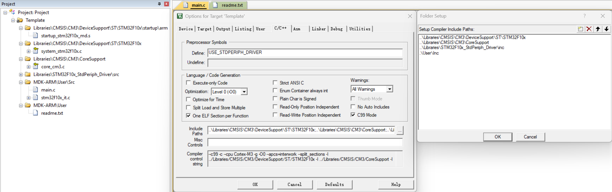

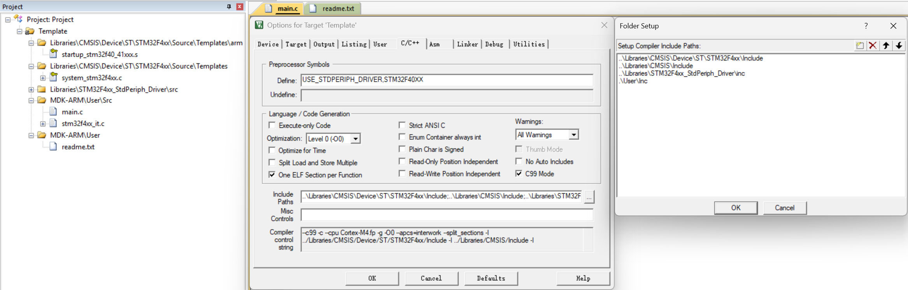

4、魔术棒设置
魔术棒图标，即 Options for Target 按钮

- Target 选项卡
  设置外部晶振频率：Xtal(MHz)：（根据片外晶振频率）
  设置 ARM Compiler 编译器：Use default compiler version 5（AC5 编译器，对中文支持较好，兼容性较好）
  
- Output 选项卡
  勾选调试信息：Debug Information
  勾选生成.hex 文件：Create HEX File 生成编译文件，可用于下载
  勾选浏览信息：Browse Information（用于输出浏览信息，才可使用 go to definition 查看函数/变量的定义，用于代码调试，若不需调试，可取消勾选以提高编译速度）

- C/C++选项卡

  - 设置全局宏定义 Define：USE_STDPERIPH_DRIVER (使用标准外设驱动 stm32f10x_conf.h)（stm32f10x.h 里会用到该宏定义，第 8296 行）
  - 设置优化等级 Optimization：Level 0 (-O0)（优化等级-O0，可以得到最好的调试效果，为了提高优化效果提升性能并降低代码量，可以设置 -O1~-O3，数字越大效果越明显，不过也越容易出问题。注意：当使用 AC6 编译器的时候，推荐默认使用 -O1 优化。）
  - 设置 C99 模式（使用 C99 C 语言标准）
  - 设置头文件包含路径（使用相对路径）

  相对路径
  ".\\"表示当前目录(Project.uvprojx 工程启动文件所在目录 MDK-ARM 文件夹下)
  "..\\"表示当前目录的上一层目录(MDK-ARM 文件夹所在目录文件夹下)
  若使用 AC6 编译器，需在 Misc Controls 处设置：-Wno-invalid-source-encoding 。避免中文编码报错。

   将所有 .h 文件 的路径 添加进去


- Debug 选项卡

  - 设置使用的仿真器：Use
  - 点击 Settings 进入仿真器设置
  - 仿真器 Debug 选项卡：注意最大时钟 Max Clock；找到器件 SW Device（需连接板子并供电）

- Utilities 选项卡

  - 使用和 Debug 一样的仿真器：Use Debug Driver
  - 进入 Settings：
    Flash Download：勾选 Program、Verify、Reset and Run

  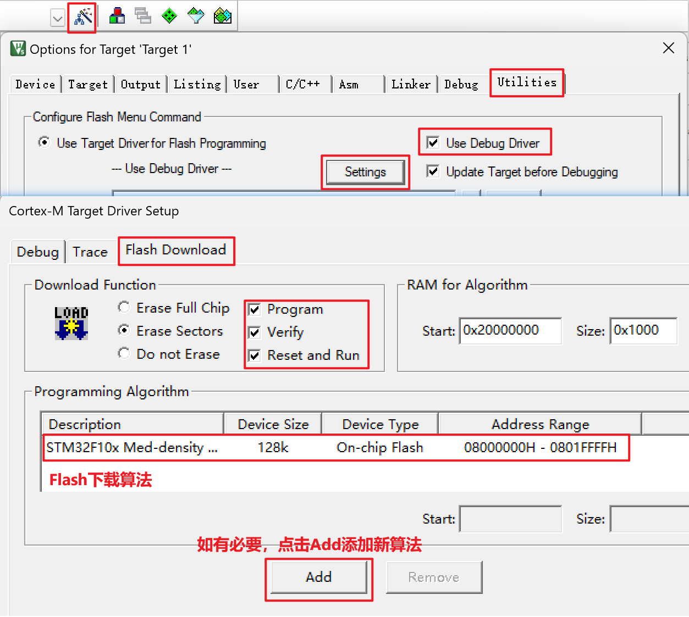

5、新建 main.c 并添加 mian 函数，进行编译

6、调试验证工程框架是否正确

7、下载验证工程相关文件是否齐全

8、在“stm32f10x_conf.h”文件中对使用的外设模块进行配置

​    可以关闭未使用的外设，在需使用时开启，以提升编译速度

 

文件前有“钥匙”图标，表示只读，不可更改


## 4.2 新建 HAL 库工程

### 4.2.1 准备

[STM32Cube MCU和MPU包 - 意法半导体STMicroelectronics](https://www.st.com.cn/zh/embedded-software/stm32cube-mcu-mpu-packages.html)

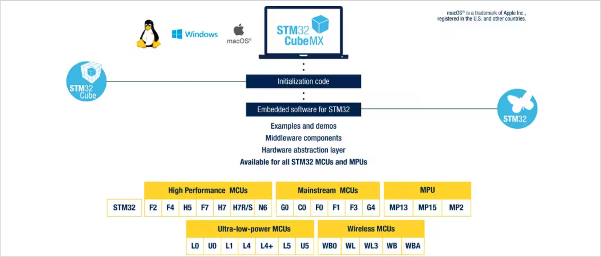 

1、STM32Cube 官方固件包：STM32Cube_FW_F1_V1.8.0

2、开发环境：MDK5 安装、仿真器及驱动、串口驱动

3、软件包：Keil.STM32F1xx_DFP.2.2.0

### 4.2.2 步骤

1、新建工程文件夹，拷贝工程相关文件

- 在项目根目录中新建工程文件夹（可中文：描述实现什么功能）
- 新建 `MDK-ARM` 文件夹，用来储存 编译文件；再在其下新建`User` 文件夹，用来储存 用户代码

- 文件目录结构：参考 附件.STM32F103HAL 库文件目录解读.mmap

| 文件名                    | 描述                                                       | 是否必须 |
| ------------------------- | ---------------------------------------------------------- | -------- |
| startup_stm32f103xb.s     | 启动文件，引导进入 main 函数                               | 是       |
| stm32f1xx.h               | STM32F1 系列的顶层头文件                                   | 是       |
| stm32f103xb.h             | 通用的片上外设访问层头文件                                 | 是       |
| system_stm32f1xx.h'.c     | 系统初始化函数定义                                         | 是       |
| cmsis_armcc.h             | AC5 编译器                                                 | 是       |
| cmsis_armclang.h          | AC6 编译器                                                 | 是       |
| cmsis_compiler.h          | AC5、AC6 编码器共用                                        | 是       |
| cmsis_version.h           | 编译器版本                                                 | 是       |
| core_cm3.h                | 内核寄存器定义，如 Systick、SCB                            | 是       |
| mpu_armv7.h               | 内存保护                                                   | 是       |
| stm32f1xx_hal.h‘.c        | HAL 库初始化、系统滴答、HAL 库延时函数                     | 是       |
| stm32f1xx_hal_def.h       | HAL 库通用的枚举类型数据和宏定义                           | 是       |
| stm32f1xx_hal_cortex.h’.c | 内核通用函数声明和定义                                     | 是       |
| stm32f1xx_hal_ppp.h'.c    | 外设驱动源码，ppp 表示任意外设                             | 用时是   |
| stm32f1xx_hal_ppp_ex.h'.c | 外设的扩展(特殊)功能的驱动源码，ppp 表示任意外设           | 用时是   |
| stm32f1xx_II_ppp..h'.c    | LL 库驱动源码，被部分 stm32f1xx_hal_ppp 或\_ex.c 调用      | 用时是   |
| Legacy文件夹              | 外设的扩展(特殊)功能补充定义和声明                         | 用时是   |
| DebugConfig文件夹         | 存放调试设置信息文件（.dbgconf），不可删除！               |          |
| Listings文件夹            | 存放编译过程产生的链接列表等文件                           |          |
| Objects文件夹             | 存放编译过程产生的调试信息、.hex、预览、.lib 文件等        |          |
| Project.uvprojx           | MDK-ARM工程文件                                            |          |
| main.c                    | 存放 main 函数，不一定放在该文件                           | 否       |
| stm32f1xx_hal_conf.h      | 用户配置文件，用于 HAL 库裁剪，配置晶振参数                | 是       |
| stm32f1xx_it.h'.c         | 存放用户中断服务函数，不一定放在该文件                     | 否       |
| keilkill.bat              | 清除编译生成的中间文件，减小工程文件大小，便于发布工程文件 | 否       |

- 拷贝相关文件：

​        将目录STM32Cube_FW_F1_V1.8.6下的Drivers拷贝进工程文件夹

​        删除BSP文件夹

​        CMSIS只保留Device、Include，其中CMSIS\Device\ST\STM32F1xx只保留Source、Include

​        STM32F1xx_HAL_Driver只保留Inc、Src

2、新建工程框架

- 打开 MDK 软件，然后点击 Project——New uVision Project
- 工程命名和保存窗口，将工程文件保存到 `MDK-ARM` 文件夹中，名字为：Project.uvprojx
- 器件选择对话框（须安装对应的软件包），使用的 MCU 是 STM32F103C8T6，
  因此选择：Device：Software Packs；
  STMicroelectronics——STM32F1 Series——STM32F103——STM32F103C8Tx
- Manage Run-Time Environment 对话框，此为 MDK5 的功能，可在此添加所需组件，便于构建开发环境，这里点击 Cancel
  此时，打开工程文件夹，MDK 在自动创建了 3 个文件夹 DebugConfig、 Listings 和 Objects

3、添加文件

- 右键 Project——Target，选择 Manage Project Items…（方法一）或在菜单栏点击品字形红绿白图标（方法二）进入工程管理界面

- 设置工程名字（Project Targets）、分组名字（Groups）以及添加每个分组的文件（Files）等操作
  设置工程名字为：Template
  按第 1 步文件目录需要设置分组（由于 MDK 分组不支持多级目录，因此将文件路径也带入分组命名里面，以便区分）
  点击 OK，回到 MDK 主界面

- 添加启动文件.s

  双击 Project 下对应的分组名添加或进入工程管理界面添加

  （此时，设置好 MDK 魔术棒，新建 main.c 程序，即可开始进行寄存器版本的工程编写了）

- 添加 HAL 库源码.c

 将 “ Drivers\STM32F1xx_HAL_Driver\Src ” 下，除了 \_template.c 以外的所有 .c 文件添加

​     可以关闭未使用的外设，在需使用时开启，以提升编译速度

 

- 添加其他源码.c
  User：在官方模板中拷贝用户源码文件

​        在 “ stm32cube_fw_f1_v180\Projects\STM32F103RB-Nucleo\Templates \Src \Inc” 中，选择

​       stm32f1xx_hal_conf.h

​       stm32f1xx_it.h'.c

​       复制进 User 文件夹

​       更改 stm32f1xx_it.c 文件中，删除 #include "main.h" ，添加 #include "stm32f1xx_hal.h"

项目最终结构：


4、魔术棒设置
魔术棒图标，即 Options for Target 按钮

- Target 选项卡
  设置外部晶振频率：Xtal(MHz)：（根据片外晶振频率）
  设置 ARM Compiler 编译器：Use default compiler version 5（AC5 编译器，对中文支持较好，兼容性较好）
- Output 选项卡
  勾选调试信息：Debug Information
  勾选生成.hex 文件：Create HEX File 生成编译文件，可用于下载
  勾选浏览信息：Browse Information（用于输出浏览信息，才可使用 go to definition 查看函数/变量的定义，用于代码调试，若不需调试，可取消勾选以提高编译速度）

- C/C++选项卡

  - 设置全局宏定义 Define：USE_HAL_DRIVER,STM32F103xx（stm32f1xx.h 里面会用到该宏定义）
  - 设置优化等级 Optimization：Level 0 (-O0)（优化等级-O0，可以得到最好的调试效果，为了提高优化效果提升性能并降低代码量，可以设置 -O1~-O3，数字越大效果越明显，不过也越容易出问题。注意：当使用 AC6 编译器的时候，推荐默认使用 -O1 优化。）
  - 设置 C99 模式（使用 C99 C 语言标准）
  - 设置头文件包含路径（使用相对路径）

   将所有 .h 文件 的路径 添加进去

- Debug 选项卡

  - 设置使用的仿真器：Use
  - 点击 Settings 进入仿真器设置
  - 仿真器 Debug 选项卡：注意最大时钟 Max Clock；找到器件 SW Device（需连接板子并供电）

- Utilities 选项卡

  - 使用和 Debug 一样的仿真器：Use Debug Driver
  - 进入 Settings：
    Flash Download：勾选 Program、Verify、Reset and Run

5、新建 main.c 并添加 mian 函数，进行编译

6、调试验证工程框架是否正确

7、下载验证工程相关文件是否齐全

### HAL 库 API 函数和变量命名规则

| 文件名                   | stm32f1xx_hal_ppp.h'.c | stm32f1xx_hal_ppp_ex.h'.c |
| ------------------------ | ---------------------- | ------------------------- |
| 函数名                   | HAL_PPP_Function       | HAL_PPPEx_Function        |
| 外设句柄                 | PPP_HandleTypeDef      | 无                        |
| 外设工作参数初始化结构体 | PPP_InitTypeDef        | PPP_InitTypeDef           |
| 配置参数结构体           | PPP_YyyyConfTypeDef    | PPP_YyyyConfTypeDef       |

初始化/反初始化函数：HAL_PPP_Init() , HAL_PPP_DeInit()

外设读写函数：HAL_PPP_Read() , HAL_PPP_Write() , HAL_PPP_Transmit() , HAL_PPP_Receive()

控制函数：HAL_PPP_Set() , HAL_PPP_Get()

状态和错误：HAL_PPP_GetState() , HAL_PPP_GetError()

### HAL 库回调函数

| 回调函数                        | 举例                                                                                                                                                          |
| ------------------------------- | ------------------------------------------------------------------------------------------------------------------------------------------------------------- |
| HAL_PPP_MspInit() / MspDeInit() | HAL_USART_MspInit()<br />会被 HAL_USART_Init() 函数调用，用于存放 USART 外设使用到的 GPIO、CLOCK、NVIC、DMA 等初始化代码                                      |
| HAL_PPP_ProcessCpltCallback     | HAL_USART_TxCpltCallback<br />由外设中断或 DMA 中断调用，HAL 库中断公共处理函数已经实现对中断标记位读取、判断和清除操作，用户只需专注于中断逻辑功能的实现即可 |
| HAL_PPP_ErrorCallback           | HAL_USART_ErrorCallback<br />外设或 DMA 中断中发生的错误，用于发生错误处理                                                                                    |

此类函数通常被 \_weak 修饰（弱函数），允许用户重新定义该函数

建议将回调函数放在对应外设初始化函数文件下，方便管理

## 4.3 新建 STM32CubeMX 工程

[STM32CubeMX - STM32Cube初始化代码生成器 - 意法半导体STMicroelectronics](https://www.st.com.cn/zh/development-tools/stm32cubemx.html#get-software)

新版本的 STM32CubeMX 软件需要登陆 myST 账号

点击 Help——Connection & Updates——myST

更改软件包目录

点击 Help——Connection & Updates——Firmware Repository : Repository  Folder更改到安装目录下

​    安装目录 \ Repository

HAL库的软件包 使用 STM32CubeMX 下载更方便


1、打开 STM32CubeMX 软件

2、下载和关联 STM32Cube 固件包

 点击 Help——Manage embedded software packages

 管理界面，找到 MCU 列表选项，勾选对应版本的固件包

 1、从本地查找关联：From Local（.zip 压缩包格式）

 2、从官网上下载：Install Now

3、新建工程

- 工程初步建立
  1、点击 File——New Project
  2、点击 ACCESS TO MCU SELECTOR
  点击新建工程后，第一次可能会联网下载一些的文件，可能等待时间比较长，可以直接选择取消即可
- 芯片选型界面
  选择具体的芯片型号
  点击五角星收藏常用芯片，此界面有芯片手册下载地址 Datasheet
  点击 Start Project
- 进入主界面

4、配置时钟源

（默认使用的是内部时钟）

Pinout & Configuration——System Core——RCC
HSE：选择 Crystal/Ceramic Resonator（使用外部晶振作为时钟源）
HSI：选择 Crystal/Ceramic Resonator
Master Clock Output 1 选项：用来选择是否使能 MCO1 引脚时钟输出。

5、配置时钟树

Clock Configuration

界面展现为该芯片完整的时钟树框图

配置的主要是外部晶振大小，分频系数，倍频系数以及选择器

配置过程中，时钟值会动态更新，若超过允许值，对应的选项框会红色提示

- 系统时钟配置

  - 时钟源参数设置：选择 HSE 为时钟源，填写 Input frequency 为硬件实际的高速晶振频率（8MHz）
  - PLL 时钟源选择：配置 PLL Source Mux 选择器选择 HSE
  - 系统时钟时钟源选择：配置 System Clock Mux 选择器选择 PLLCLK
  - 经过上面的配置系统时钟 SYSCLK = 72 MHz

- 片上外设或内核工作时钟配置（Systick、AHB、APB1、APB2）

  AHB、 APB1 和 APB2 总线时钟以及 Systick 时钟的来源于系统时钟 SYSCLK

  - AHB 总线时钟 HCLK 配置：配置 AHB 预分频器 (AHB Prescaler) 预分频系数为（1），则 HCLK = 72MHz
  - Systick 时钟配置：配置 To Cortex System timer 分频系数为（1），则 Systick = 72MHz
  - APB1 时钟 PCLK1 配置：配置 APB1 预分频器 (APB1 Prescaler) 预分频系数为（2），则 PCLK1 = 36MHz
  - APB2 时钟 PCLK2 配置：配置 APB2 预分频器 (APB2 Prescaler) 预分频系数为（1），则 PCLK2 = 72MHz

- **直接编辑 HCLK 的时钟频率**，按回车键，CubeMX 会提供配置时钟频率和其他时钟的建议，选择是，由软件自动配置，只有启用外部晶振才可

6、GPIO 功能引脚配置

 Pinout & Configuration

- **Debug 配置**
  用 CubeMX 生成的工程编译下载一次后，后续再次下载就会提示错误，因此需把 Debug 选项打开
  System Core——SYS——Debug：Serial Wire
  若未开启 Debug 选项，下次配置好 Debug 重新更新程序，下载时，按住复位键，等工程提示时松开复位键即可，因 STM32 默认复位上电时的 Debug 引脚功能是开启的，或者使用 bootloader 清除未开启 Debug 的程序，重新创建配置好 Debug 的程序

  - 若使用 STM32CubeMX+Keil MDK 开发，不配置 Debug，而是在 MDK 中配置仿真下载器，也是可以的？？我自己新建了一个工程未配置可以多次更改下载

- 在芯片视图界面（右下角）搜索栏中搜索想配置的 GPIO 号（PE0、PE1），回车，可在引脚图中显示位置
- 点击引脚图中的 GPIO 位置，在弹出的下拉菜单中，选择 IO 口的功能，设置好可见引脚从灰色变为绿色，标识该引脚已经被启用
- 配置 IO 口的速率、上拉下拉极性等参数：Pinout & Configuration——System Core——GPIO，在 GPIO 列表中点击对应 IO 口，在下面的配置界面 Pxx Configuration
  - GPIO output level：IO 口的初始值（高/地电平）
  - GPIO mode：模式
  - GPIO Pull-up/Pull-down：上拉/下拉
  - Maximum output speed：输出速度配置
  - User Label：用户符号，可以给 GPIO 起一个别名，便于理解

7、配置工程选项

Project Manager——Project

- Project Name：工程名称，填入工程名称 （半角，不能有中文字符） Project

 工程名称将影响工程文件夹及其中相关项目的命名

 **工程建立后，可将工程文件夹名称 Project 更改为指明该工程功能的英文名称，便于管理**

- Project Location：工程保存路径，点击 Browse 选择保存的位置 （半角，不 能有中文字符）
- Application Structure：应用的结构，选择 Advanced (高级)，不勾选 Do not generate the main()，需要其生成 main 函数
- Toolchain Folder Location：工具链文件夹位置，默认(工程保存路径)即可。
- Toolchain/IDE：工具链 /集成开发环境，若使用 Keil，选择 MDK-ARM，Min Version 选择 V5.32 (根据使用Keil版本选择相近的)
- Linker Settings 链接器设置：
  Minimum Heap Size 最小堆大小，默认（大工程需按需调整）
  Minimum Stack Size 最小栈大小，默认（大工程需按需调整）
- MCU and Firmware Package 是 MCU 及固件包设置：
  MCU Reference：目标 MCU 系列名称。
  Firmware Package Name and Version：固件包名称及版本。
  默认使用最新的固件包版本，取消勾选 Use Default Firmware Location，可选择实际使用的固件包版本，选择其路径即可

8、配置代码生成选项

Project Manager——Code Generator

- STM32Cube MCU packages and embeddeb software packs 芯片软件包和嵌入式软件包设置

​        1、Copy all used libraries into the project folder复制所有的库文件到工程目录中；

​        2、Copy only the necessary library files只复制必须的库到工程目录中；

​        3、Add necessary library files as reference in the toolchain project configuration file不复制库文件到工程目录中，仅引用安装目录的库文件。

​        一般选择 2。

- Generated files 生成代码设置

  1、Generate peripheral initialization as a pir of ‘.c/.h’files per peripheral 每个外设有单独的 .c/.h 文件；

  2、Backup previously generated files when re-generating每次重新生成代码会备份以前的代码工程；

  3、Keep User Code when re-generating重新生成代码时，保留用户代码(必须写在用户代码指定位置)；

  4、Delete previously generated files wen not re-generated重新生成代码时，删除此次生成未使用的代码（上次生成时使用过）。

  一般选择 1，3，4。
  
* 

9、生成工程

至此完成工程最基础配置，点击 GENERATE CODE 可生成工程代码

在弹出窗口中点击 Open Project 可直接打开 MDK 工程。

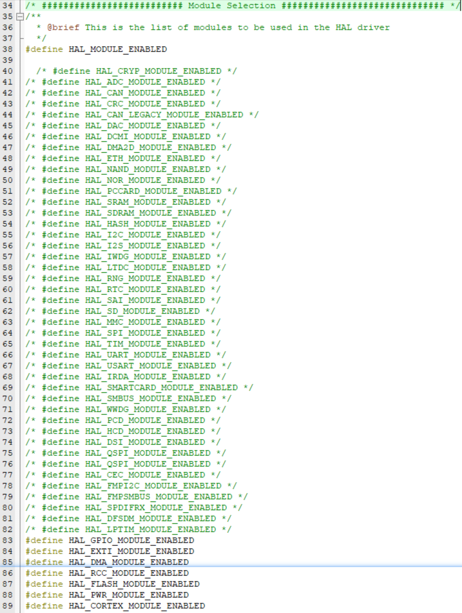 


10、生成的工程目录结构

- Drivers 文件夹存放的是 CMSIS 核心层、STM32F1xx_HAL_Driver 源码。

- Core文件夹存放的是工程应用层(MCU外设配置程序)的代码

  Inc 文件夹存放的是工程必须的部分源文件的头文件。

  Src 文件夹存放的是工程必须的部分源文件。

- MDK-ARM 文件夹存放的是 MDK 工程文件。

- xxx.ioc 文件是 STM32CubeMX 工程文件，双击该文件就会在 STM32CubeMX 中打开。

11、编写用户程序

STM32CubeMX 生成的 main.c 文件中，有很多地方有“/_ USER CODE BEGIN X \*/”和 “/_ USER CODE END X \*/”格式的注释，**在 BEGIN 和 END 之间编写用户代码**，重新生成工程之后，这些代码会保留而不会被覆盖 。

12、在项目文件夹下添加文件夹，用于存放自己的封装函数库

 在 main.c 中的规定位置编写代码

 在 STM32CubeMX 中新增 GPIO 引脚配置等操作，点击 GENERATE CODE，不会清除自己的函数库文件

 在Core工程文件夹中添加用户代码，文件名称统一前缀“user_xxx”，将.c文件放在Src 文件夹，将.h文件放在Inc 文件夹，这样不用再在MDK软件中配置用户代码的头文件路径，直接就可以编译工程

## 4.4 程序调试

### 4.4.1 调试方式

1. 串口调试：通过串口通信，将调试信息发送到电脑端，电脑使用串口助手显示调试信息
2. 显示屏调试：直接将显示屏连接到单片机，将调试信息打印在显示屏上
3. Keil 调试模式：借助 Keil 软件的调试模式，可使用单步运行、设置断点、查看寄存器及变量等功能
4. 点灯调试：在需要调试程序的位置，放一个点灯的程序，如果运行到了，灯就亮，如果没运行到，灯就不亮
5. 注释调试：如果程序本来可以运行，但是加了某段程序后就不能运行，就可以逐步注释程序，恢复到正常运行状态
6. 对照调试：与正常运行的程序对照，在其程序逻辑上，逐步替换成自己的程序逻辑，找出自己程序的问题点

基本思想：缩小范围、控制变量、对此测试

### 4.4.2 Keil 调试模式

1、魔术棒设置

 Debug——

 左边，Use Simulator：使用仿真器（不需要硬件，电脑模拟 STM32 的运行）

 右边，Use：可选调试仿真器（DAP、ST-Link）（使用硬件的在线仿真）

2、将调试仿真器连接上 STM32 板，编译工程，并确保工程无错误、无警告

3、进入调试模式：点击“放大镜里带 d”的图标

 上边的工具栏：Reset——复位；Run——运行；Stop——停止运行；Step——单步运行；Step Over——跳过当前行单步运行；Step Out——跳出当前函数单步运行；Run to Cursor Line——跳到光标指定行单步运行

 Command Window——命令窗口：打开或关闭命令窗口；

 Disassembly Window——汇编窗口：打开或关闭汇编窗口；

 Symbols Window——符号窗口：打开或关闭汇编窗口，打开后在右边，选择想查看的符号，右键选择 Add 'xxx' to，Watch 1 ，右下边弹出 Watch 1 窗口，可查看程序中所有变量的值；

 Serial Windows——串口显示；

 Analysis Windows——逻辑分析仪；

 最上边的菜单栏：Peripherals——外设菜单栏，System Viewer——系统资源，查看所有的外设寄存器

 以 PA0 上的 LED 闪烁试验为例，选择 GPIO——GPIOA，右边弹出 GPIOA 的所有寄存器，选择 ODR——ODR0，是 PA0 的输出数据寄存器，运行调试模式，ODR0 实时显示数据变化，与硬件 LED 闪烁频率一致，可随时控制程序的运行、停止、单步运行；

 黄色右箭头指示下一句将执行的代码行

 蓝色右箭头指示光标指定行

 点击代码行左侧（行号左侧）可设置断点，点击 运行， 程序将一直运行，直到断点再停止

 点击 复位 ，程序回到最开始的地方，在启动文件中的复位中断函数中

 主窗口为 C 语言程序界面，

 上面的窗口 Disassembly 为 C 语言编译成的汇编语言程序

 左边的窗口 Registers 为寄存器组、状态标志位等（STM32 硬件底层）


 左下边的 Command——命令窗口：

 右下边的 Call Stack + Locals——

 修改程序不能直接在调试模式下进行修改，需退出调试模式，修改，重新编译，再进入调试模式

通用外设驱动模型（四步法）

1、初始化：

 时钟设置、参数设置

 （可选） IO 设置、中断设置（开中断、设 NVIC）

2、（可选）读函数：

 从外设读取数据（可选）

3、（可选）写函数：

 从外设写入数据（可选）

4、（可选）中断服务函数：

 根据中断标志，处理外设各种中断事物（可选）

# 第 5 章 通用和复用功能 I/O (GPIO、AFIO)

通用目的的输入/输出 General Purpose Input Output

复用输入输出口 AFIO

## 5.1 简介

可配置为 8 种输入输出模式

引脚电平：0V~3.3V，部分引脚可容忍 5V

输出模式下可控制端口输出高低电平，用以驱动 LED、控制蜂鸣器、模拟通信协议输出时序等

输入模式下可读取端口的高低电平或电压，用于读取按键输入、外接模块电平信号输入、ADC 电压采集、模拟通信协议接收数据等

## 5.2 IO 引脚分布

特殊功能引脚：彩色，无法通过程序控制

普通 IO 引脚：灰色，可通过程序控制


## 5.3 基本结构


在 STM32 中，所有的 GPIO 外设都挂载在 APB2 外设总线上

GPIO 外设的名称为 GPIOA、GPIOB ... ...

每个 GPIO 外设总共有 16 个引脚，编号是从 0 到 15，GPIOA 的第 0 号引脚，称为 PA0

GPIO 外设内主要包含寄存器、驱动器

- 寄存器：是具有特定功能的内存单元，是程序与硬件电路连接的桥梁，存储着芯片中特定功能电路的开关信息
  可通过程序对寄存器中的数据进行修改，来改变芯片中某功能电路的开关，或者通过程序对寄存器数据进行读取，来获取芯片中某段功能电路的当前状态

  控制单片机实际上就是在控制寄存器

  STM32 是 32 位单片机，内部的寄存器都是 32 位的，但 GPIO 外设的引脚只有 16 个，所以寄存器的低 16 位对应 GPIO 外设的 16 个引脚，而高 16 位未使用

  寄存器的每一位对应一个引脚

  - 输出寄存器写 1，对应的引脚输出高电平；写 0 输出低电平
  - 输入寄存器读取为 1，表示对应引脚当前是高电平；读取为 0 为低电平

- 驱动器：增加信号的驱动能力

## 5.4 IO 位结构

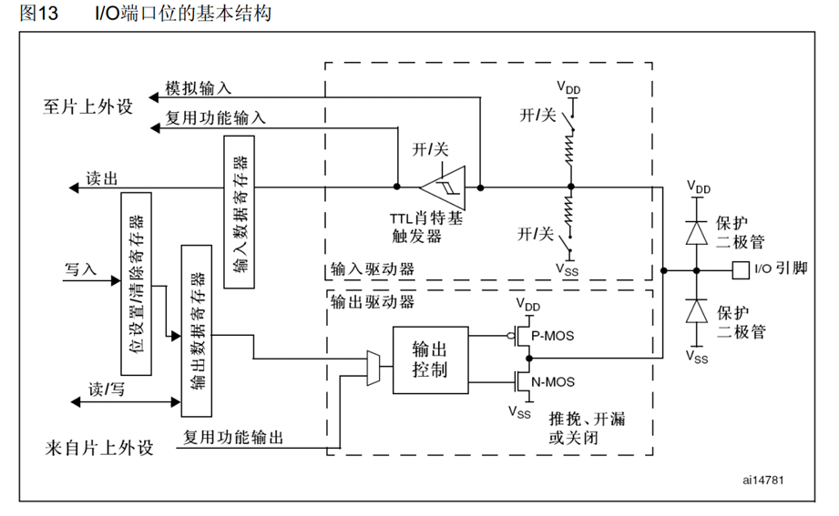

### 5.4.1 保护二极管

由于芯片内部电路所能承受的电压有限，因而从 IO 引脚向里是两个保护二极管

当有静电等瞬间电压波动进入 IO 引脚时，若此电压大于 VDD(3.3V)时，则上方的保护二极管导通，将波动电压引入电源，由电源网络吸收；

当波动电压小于 VSS(0V)时，下方保护二极管导通，波动电压被引入 GND 中吸收。

此结构也仅能抵御一瞬间的电压波动，若较长时间将较高的电压接入 IO 引脚依旧会损坏芯片

此外，STM32 芯片中有一部分 IO 引脚可容忍 5V，即可承受 5V 电压作为高电平输入，该 IO 引脚的上方保护二极管电压为 VDD_FT(5V)

### 5.4.2 输出驱动器

1、推挽、开漏或开关

P-MOS 的漏极接高电平(3.3V)，N-MOS 的源极接低电平(0V)

- 推挽：一对 MOS 管交替导通，对外输出高电压或低电压

  上 MOS 导通，下 MOS 就关断；下 MOS 导通，上 MOS 就关断

  具有一定的电压与电流驱动能力，可直接驱动一些元件工作，不适用驱动更高或更低的工作电压的元件

- 开漏：上 MOS 恒断，对外输出高阻抗或低电压
  若向 IO 引脚写 1，则 IO 引脚内部处于高阻抗，即断路；若向 IO 引脚写 0，则下 MOS 导通
  此时，开漏模式需要外部的电压源来驱动元件，向 IO 引脚写 0，元件电路导通
  并且使用开漏模式驱动元件，需要使用 5V 容忍的 IO 引脚，否则若使用普通 IO 引脚会使上方保护二极管长期导通，将 5V 引入电源网络中造成损坏

|            | 输出推挽                         | 输出开漏                                   |
| ---------- | -------------------------------- | ------------------------------------------ |
| 输出高电平 | P-MOS 导通、N-MOS 断开<br />3.3V | P-MOS 断开、N-MOS 断开<br />由外部电路决定 |
| 输出低电平 | P-MOS 断开、N-MOS 导通<br />0V   | P-MOS 断开、N-MOS 导通<br />0V             |
| 优点       | 可直接输出 3.3V                  | 配合外部电路 更加灵活                      |
| 缺点       | 只能输出 3.3V                    | 高电平是高阻抗，无法输出电流               |

2、输出控制指令来源

输出控制只能有一个指令来源

- 通用功能（直接控制）：通过程序对输出数据寄存器写入高低电平信号，直接控制 IO 引脚输出高低电压
- 复用功能（片上外设控制）：将 IO 引脚的输出控制权交给片上外设，此时不能直接控制该引脚的输出，如串口模块发送数据

|      | 输出推挽     | 输出开漏     |
| ---- | ------------ | ------------ |
| 通用 | 通用输出推挽 | 通用输出开漏 |
| 复用 | 复用输出推挽 | 复用输出开漏 |

### 5.4.3 输入驱动器

外部输入的电流从 IO 引脚进入后，首先经过一对上拉下拉电阻，然后经过 TTL 触发器，写入输入数据寄存器，使用程序直接读取

1、TTL 触发器：稳定电平信号

因外部输入的电压可能不太稳定，并不总能达到标准的 3.3V 或者 0V
比较器：规定一个参考电压(1.65V)，高于此电压输出高电平，低于此电压输出低电平
但若输入电压中噪声较多，在参考电压附近徘徊，导致高低电平快速变化，就无法准确测得当前电平，因而将比较器改造成 TTL 触发器：
规定两个参考电压，当输入电压高于高参考电压则输出高电平，当输入电压低于低参考电压则输出低电平，在两者之间则维持原本的电平信号不变
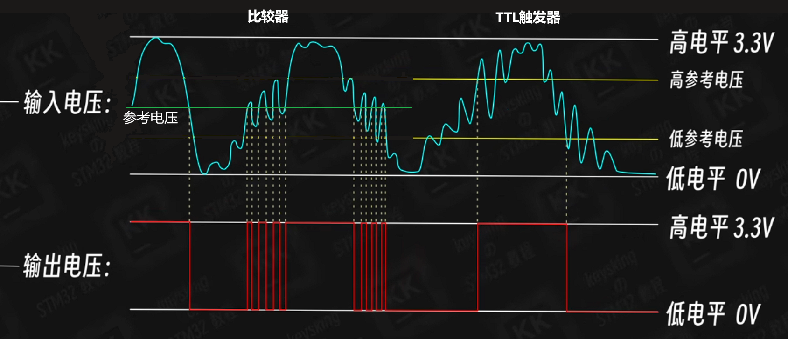

- 输入上拉：设置上拉电阻启用，当引脚悬空时，提供默认的高电压
- 输入下拉：设置下拉电阻启用，当引脚悬空时，提供默认的低电压
- 输入浮空：上下拉电阻都不启用，与输出开漏类似，可依赖外部电路实现更多可能性
- 复用功能输入：在 TTL 触发器后接入需要数字输入的片上外设，如串口模块接受 IO 引脚上来自外部的数字信号

输入控制的不同分支可以同时读取 TTL 触发器的输出电平信号，没有复用上/下拉输入等模式，而是在片上外设上也使用通用输入模式即可

以上四种输入模式仅读取了高低电平，即数字输入；

- 模拟输入：在 TTL 触发器前将电压引入模拟输入相关的片上外设(ADC)，读取输入电压的具体数值

使用电压表测量电阻两端的电压，电压表的内阻必须非常大，否侧就会影响被测电路的状态，测得的电压就不准

当 IO 引脚工作在输入模式下时，其作用是测量外部输入信号的电平，相当于电压表，因此其内阻也应是无穷大，无穷大的电阻相当于开路，如果不接上/下拉电阻，此时 IO 引脚完全悬空，悬空的引脚就像一条天线，极易受外界信号的干扰，会接受空间的电磁波，就会读到随机的 0 或 1，应避免这种情况发生

加入上拉电阻，此时电路由无穷大的内阻与上拉电阻分压，因为内阻无穷大，将分的全部 Vdd，而上拉电阻会分得 0V，因此 IO 引脚内部就为高电压 Vdd

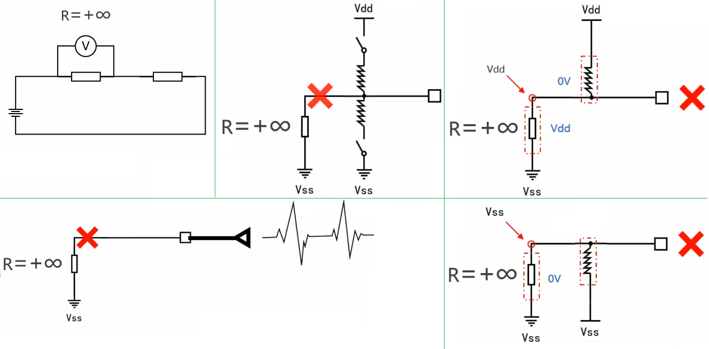

## 5.5 GPIO 模式

通过配置 GPIO 的端口配置寄存器，端口可以配置成以下 8 种模式

- 输出：

| 模式名称     | 英文                                            | 性质     | 特征                                         |
| ------------ | ----------------------------------------------- | -------- | -------------------------------------------- |
| 通用输出推挽 | GPIO_Mode_Out_PP (Push-Pull Output)             | 数字输出 | 可输出引脚电平，高电平接 VDD，低电平接 VSS   |
| 复用输出推挽 | GPIO_Mode_AF_PP (Alternate Function Push-Pull)  | 数字输出 | 由片上外设控制，高电平接 VDD，低电平接 VSS   |
| 通用输出开漏 | GPIO_Mode_Out_OD (Open-Drain Output)            | 数字输出 | 可输出引脚电平，高电平为高阻态，低电平接 VSS |
| 复用输出开漏 | GPIO_Mode_AF_OD (Alternate Function Open-Drain) | 数字输出 | 由片上外设控制，高电平为高阻态，低电平接 VSS |

- 输入：

| 模式名称 | 英文                                   | 性质     | 特征                                               |
| -------- | -------------------------------------- | -------- | -------------------------------------------------- |
| 输入浮空 | GPIO_Mode_IN_FLOATING (Floating Input) | 数字输入 | 可读取引脚电平，若引脚悬空，则电平不确定           |
| 输入上拉 | GPIO_Mode_IPU (Input with Pull-Up)     | 数字输入 | 可读取引脚电平，内部连接上拉电阻，悬空时默认高电平 |
| 输入下拉 | GPIO_Mode_IPD (Input with Pull-Down)   | 数字输入 | 可读取引脚电平，内部连接下拉电阻，悬空时默认低电平 |
| 输入模拟 | GPIO_Mode_AIN (Analog Input)           | 模拟输入 | GPIO 无效，引脚直接接入片上外设 ADC                |

## 5.6 GPIO 最大输出速度

理想情况下，向 IO 引脚写 1，立刻输出高电压；向 IO 引脚写 0，立刻输出低电压

实际情况下，IO 引脚高低电压的切换不可能瞬间完成，写 1 后，IO 引脚上的电压缓慢上升；写 0 后，IO 引脚上的电压缓慢下降

上升时间：电压上升至高电平所需的时间

下降时间：电压下降至低电平所需的时间

保持时间：上升时间与下降时间之间输出有效电平的时间

加快电压的切换速度，若保持上升时间、下降时间不变，即 GPIO 输出速度不变，上升沿和下降沿的斜坡越靠越近，保持时间越来越短，直至上升时间与下降时间重合，保持时间为 0，不能输出有效电压

加快 GPIO 输出速度，即加快上升时间、下降时间，上升沿和下降沿的斜坡更陡，就可继续输出有效电压

上升时间和下降时间限制了 IO 引脚的最大输出速度，上升时间和下降时间越短，IO 引脚的最大输出速度就越大

STM32 有 3 中输出速度可选：

低速：2MHz，每秒钟切换 2000000 次

中速：10MHz，每秒钟切换 10000000 次

高速：50MHz，每秒钟切换 50000000 次

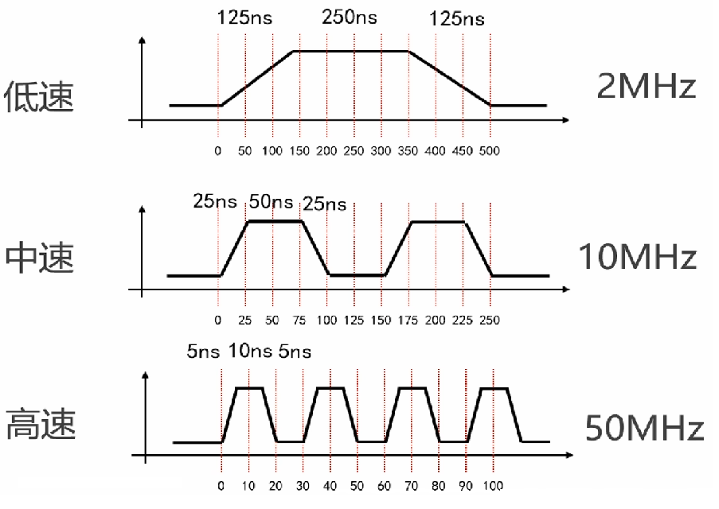

实际应用中，如何选取 GPIO 最大输出速度？

选取满足要求的最小值。

因过快的上升沿和下降沿会增加芯片的功耗，同时会使得数字信号的带宽增加，从而对单片机电路板上的其他电子元器件产生更强的电磁干扰

举例：

1、使用芯片的 IO 引脚驱动发光二极管

 人眼能分辨的闪烁频率约为：每秒切换 10 次

 所以驱动发光二极管的频率也不宜太高，一般不会超过 1000Hz，选择 GPIO 最大输出速度为低速 2MHz 即可

2、编码器，使用通信协议总线与芯片进行通信，其官方标称的最大通信速率比如为 8Mbps，则选择 GPIO 最大输出速度为中速 10MHz 即可

3、USB 2.0 Fs （USB2.0 全速接口），其通信速率为 12Mbps，则选择 GPIO 最大输出速度为高速 50MHz

## 5.7 IO 复用和重映射

IO 复用：一个 IO 引脚具有多种不同的功能，既可以直接使用程序控制，也可以给片上外设使用

复用功能重映射：将冲突的复用功能移动到其他备用引脚上去

在 STM32 中，AFIO 主要完成两个任务：复用功能引脚重映射、中断引脚选择

《STM32F10xxx 参考手册\_10_zh》P137 图 20 外部中断通用 I/O 映像

STM32 芯片上电，各 IO 引脚默认为 主功能

对于 调试端口重映射，需先关闭该端口 对应的 调试功能（主功能），再配置重映射功能

有 3 个参数选择

GPIO_Remap_SWJ_NoJTRST : Full SWJ Enabled (JTAG-DP + SW-DP) but without JTRST

 完全 SWJ (JTAG-DP + SW-DP) 但没有 JTRST （PB4 成普通的 IO 引脚）

GPIO_Remap_SWJ_JTAGDisable : JTAG-DP Disabled and SW-DP Enabled

 关闭 JTAG-DP 启用 SW-DP （PA15、PB3、PB4 成普通的 IO 引脚）

GPIO_Remap_SWJ_Disable : Full SWJ Disabled (JTAG-DP + SW-DP)

 关闭 SWD 关闭 JTAG （PA13、PA14、PA15、PB3、PB4 都成普通的 IO 引脚）

 注意：使用该参数并下载程序后，将取消 STM32 的调试端口，只能使用串口下载有调试端口的程序来恢复

《STM32F10xxx 参考手册\_10_zh》P118 表 35 调试端口映像

《STM32F10xxx 参考手册\_10_zh》P38

注：因为模拟开关只能通过少量的电流 (3mA) ，在输出模式下使用 PC13 至 PC15 的 I/O 口功能是有限制的：速度必须限制在 2MHz 以下，最大负载为 30pF ，而且这些 I/O 口绝对不能当作电流源 (如驱动 LED )

# 第 6 章 外部中断(EXTI)

## 6.1 中断系统

中断：

在主程序运行过程中，出现了特定的中断触发条件（中断源），使得 CPU 暂停当前正在运行的程序，转而去处理中断程序，处理完成后又返回原来被暂停的位置继续运行

中断优先级：

当有多个中断源同时申请中断时，CPU 会根据中断源的轻重缓急进行裁决，优先响应更加紧急的中断源

中断嵌套：

当一个中断程序正在运行时，又有新的更高优先级的中断源申请中断，CPU 再次暂停当前中断程序，转而去处理新的中断程序，处理完成后依次进行返回

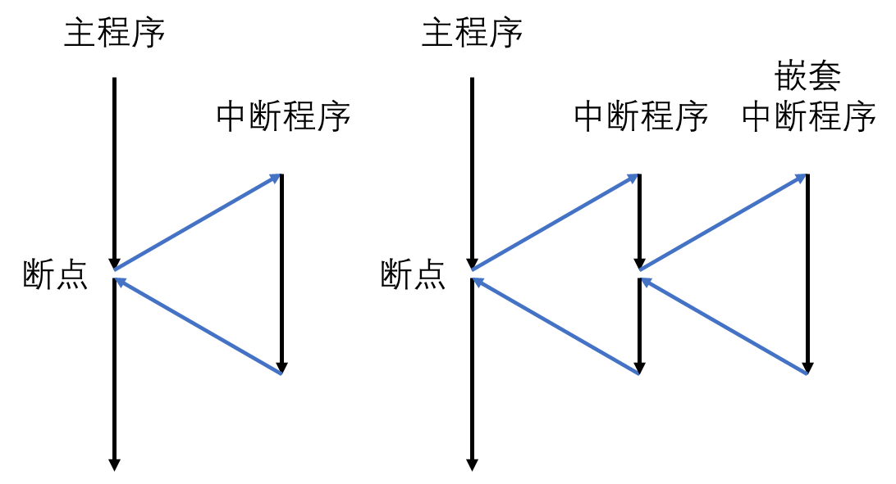

## 6.2 STM32 中断

68 个可屏蔽中断通道，包含 EXTI、TIM、ADC、USART、SPI、I2C、RTC 等多个外设

中断通道即中断源

 《STM32F10xxx 参考手册\_10_zh》P132 表 55 其它 STM32F10xxx 产品(小容量、中容量和大容量)的向量表

使用 NVIC 统一管理中断，每个中断通道都拥有 16 个可编程的优先等级，可对优先级进行分组，进一步设置抢占优先级和响应优先级

## 6.3 NVIC 基本结构


NVIC 有很多输入口，只有一个输出口（输出到 CPU）

一个外设可能会同时占用多个中断通道

NVIC 根据每个中断的优先级分配中断的先后顺序，告诉 CPU 该处理哪个中断

## 6.4 NVIC 优先级分组

NVIC 的中断优先级由优先级寄存器的 4 位（0~15）决定，这 4 位可以进行切分，分为高 n 位的抢占优先级和低 4-n 位的响应优先级

优先级的数是值越小，优先级越高，0 是最高优先级

抢占优先级高的可以中断嵌套，响应优先级高的可以优先排队（插队），抢占优先级和响应优先级均相同的按中断号排队

| 分组方式 | 抢占优先级        | 响应优先级        |
| -------- | ----------------- | ----------------- |
| 分组 0   | 0 位，取值为 0    | 4 位，取值为 0~15 |
| 分组 1   | 1 位，取值为 0~1  | 3 位，取值为 0~7  |
| 分组 2   | 2 位，取值为 0~3  | 2 位，取值为 0~3  |
| 分组 3   | 3 位，取值为 0~7  | 1 位，取值为 0~1  |
| 分组 4   | 4 位，取值为 0~15 | 0 位，取值为 0    |

## 6.5 EXTI 简介

外部中断 EXTI (Extern Interrupt)

EXTI 可以监测指定 GPIO 口的电平信号，当指定的 GPIO 口产生电平变化时，EXTI 将立即向 NVIC 发出中断申请，经过 NVIC 裁决后即可中断 CPU 主程序，使 CPU 执行 EXTI 对应的中断程序

1、支持的触发方式：上升沿/下降沿/双边沿/软件触发

 上升沿：GPIO 口电平从低电平变到高电平的瞬间

 下降沿：GPIO 口电平从高电平变到低电平的瞬间

 双边沿：上升沿或者下降沿的瞬间

 软件触发：不关心 GPIO 口电平变化，执行程序代码，触发中断

2、支持的 GPIO 口：所有 GPIO 口

 但**相同的 Pin 不能同时触发中断**（比如 PA0 和 PB0 不能同时用于触发中断）

3、通道数：16 个 GPIO_Pin，外加 PVD 输出、RTC 闹钟、USB 唤醒、以太网唤醒 （20 个通道数）

4、触发响应方式：中断响应/事件响应

 中断响应是正常的流程，引脚电平变化触发中断

 事件响应不会触发中断，而是触发其他的外设操作，属于外设之间的联合工作

## 6.6 EXTI 基本结构


每个 GPIO 外设有 16 个引脚，通过 AFIO 中断引脚选择 其中的一个引脚，作为中断通道（这就是相同的 Pin 不能同时触发中断的原因），外加 PVD 输出、RTC 闹钟、USB 唤醒、以太网唤醒 组成 EXTI 的 20 个输入信号

经过 EXTI 边沿检测及控制 ，分为两种输出，一种是 中断响应 （NVIC） ，另一种是 事件响应 （其他外设）

 其中外部中断的 EXTI9\~5、EXTI15\~10，分配在一个通道里，EXTI9\~5 会触发同一个中断函数，EXTI15\~10 会触发同一个中断函数，编程时，在这两个中断函数里，需根据标志位来区分到底是哪个中断

## 6.7 EXTI 框图

《STM32F10xxx 参考手册\_10_zh》P135 图 19 外部中断/事件控制器框图

请求挂起寄存器：相当于中断的标志位，可读取该寄存器判断是哪个通道触发的中断

中断屏蔽寄存器：相当于开关，置 1 时，允许中断；置 0 时，屏蔽中断

## 6.8 EXTI 的应用场景

获取由外部驱动的很快的突发信号，比如旋转编码器的输出信号，不拧它时，不需要 STM32 做任何事，但是一拧它，就需要 STM32 接收很多脉冲信号，用外部中断来读取

 这个信号是突发的，STM32 不知它什么时候会来，

 它是外部驱动的，STM32 只能被动读取，

 它非常快，STM32 稍晚一点读取就会错过很多脉冲波形

比如红外遥控接收头的输出信号，接收到遥控数据后，会输出一段波形，这个波形转瞬即逝，用外部中断来读取

比如按键的输出信号，虽然也是外部驱动的突发信号，但是外部中断不好处理按键抖动和松手检测的问题，它的信号也不是转瞬即逝的，可以在主程序中循环读

取，也可用定时器中断读取

## 6.9 外部中断编程的建议

1、在中断函数中，不要执行耗时过长的代码，要简短快速，否则将造成主函数阻塞

2、不要在中断函数和主函数中调用相同的函数或者操作同一个硬件，否则该被调用函数和被操作硬件可能出现错误

# 第 7 章 定时器(TIM)

定时器 TIM (Timer)

## 7.1 TIM 简介

定时器可以对输入的时钟进行计数，并在计数值达到设定值时触发中断

### 7.1.1 软件定时原理

使用纯软件（CPU 死等）的方式实现定时（延时）功能

```c
void delay_us(uint32_t us)
{
  us *= 72;    /*延时因子，根据芯片主频定义，STM32F103最大系统时钟频率为72MHz*/
  while(us --);
}
```

不精准的原因：

1、函数调用有压栈、出栈的过程，需消耗时间

2、STM32 内核架构是 arm，有 流水线 机制，指令将被分解成多个指令来执行，执行时间不确定

缺点：

1、延时不精准

2、CPU 死等

### 7.1.2 定时器定时原理

使用精准的时基，通过硬件的方式，实现定时功能

定时器的核心是计数器

## 7.2 定时器类型

1、常规定时器：基本定时器、通用定时器、高级定时器

2、专用定时器：独立看门狗、窗口看门狗、实时时钟 RTC、低功耗定时器

3、内核定时器：SYSTick 定时器

不同定时器是互相独立的，不共享任何资源，可同时使用

## 7.3 定时器特性表

| 类型       | 定时器                 | 计数器位数 | 计数模式             | 预分频系数(整数) | 产生 DMA 请求 | 捕获/比较通道 | 互补输出 |
| ---------- | ---------------------- | ---------- | -------------------- | ---------------- | ------------- | ------------- | -------- |
| 基本定时器 | TIM6、TIM7             | 16         | 递增                 | 1~65535          | 可以          | 0             | 无       |
| 通用定时器 | TIM2、TIM3、TIM4、TIM5 | 16         | 递增、递减、中央对齐 | 1~65535          | 可以          | 4             | 无       |
| 高级定时器 | TIM1、TIM8             | 16         | 递增、递减、中央对齐 | 1~65535          | 可以          | 4             | 有       |

STM32F103C8T6 定时器资源：TIM1、TIM2、TIM3、TIM4

## 7.4 基本、通用、高级定时器功能的区别

| 类型       | 功能                                                                                               |
| ---------- | -------------------------------------------------------------------------------------------------- |
| 基本定时器 | 定时中断、主模式触发 DAC，没有输入输出通道，常用作时基，即定时功能                                 |
| 通用定时器 | 基本定时器全部功能，多路独立的通道，内外时钟源选择、输入捕获、输出比较、编码器接口、主从触发模式等 |
| 高级定时器 | 通用定时器全部功能，重复计数器、死区生成、互补输出、刹车输入等功能（常用于电机控制、数字电源）     |

## 7.5 定时器计数模式及溢出条件

| 计数器模式 | 溢出条件                                                             |
| ---------- | -------------------------------------------------------------------- |
| 递增       | 计数器的值 CNT == 自动重装载影子寄存器的值 ARR                       |
| 递减       | 计数器的值 CNT == 0                                                  |
| 中央对齐   | 计数器的值 CNT == 自动重装载影子寄存器的值 ARR-1、计数器的值 CNT ==1 |

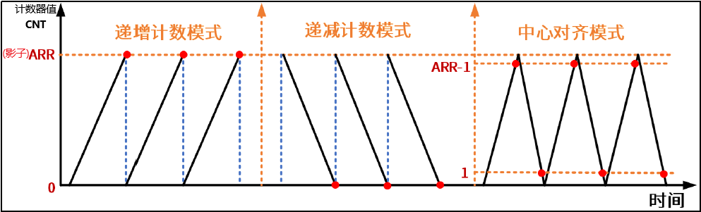

 由计数器递增计数产生的溢出，称为 **定时器上溢** 。

 由计数器递减计数产生的溢出，称为 **定时器下溢** 。

通过修改自动重载寄存器的值 ARR，可改变定时时间

通过修改预分频寄存器的值 PSC，可改变计数频率（CNT 的斜率），也可改变定时时间

## 7.6 TIM 的应用

1、定时器基本定时功能，定一个时间，让定时器每隔这个时间产生一个中断，比如时钟、秒表，或者适用一些程序算法

2、定时器输出比较的功能，比如产生 PWM，用于驱动电机等设备

3、定时器输入捕获的功能，比如测量方波频率

4、定时器编码器接口，比如读取正交编码器的输出波形

## 7.7 基本定时器

### 7.7.1 主要特性

16 位自动重装载累加计数器（计数值 0~65535）

16 位可编程（可实时修改）预分频器，预分频系数 1~65535，对输入时钟频率进行分频得到计数器时钟频率

触发 DAC 的同步电路

在计数器溢出（更新事件）时可产生中断/DMA 请求

### 7.7.2 基本定时器框图

《STM32F10xxx 参考手册\_10_zh》P298 图 144 基本定时器框图

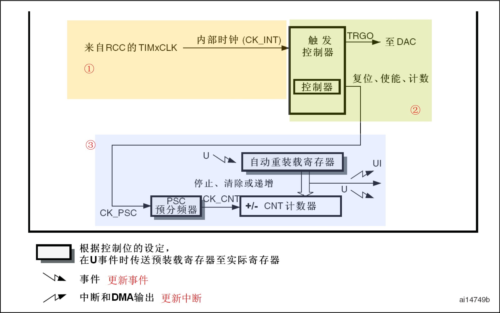

① 时钟源

 基本定时器时钟 CK_INT 来自 APB1 总线上的 TIMxCLK

 当 APB1 的预分频系数=1，则基本定时器时钟频率=APB1 时钟频率

 若 APB1 的预分频系数>1，则基本定时器时钟频率=APB1 时钟频率 x2

② 控制器

 控制定时器复位、使能、计数，触发 DAC 转换

 主模式选择：控制寄存器 2 TIMx_CR2 的 MMS 位控制，当该位置 010：更新——更新事件被用作为触发输出触发控制器 TRGO(Trigger Out)

 例如一个主定时器可以作为从定时器的预分频器使用。

 例如 TRGO 直接接到 DAC 的触发转换引脚上，这样定时器的更新就不需要触发中断来触发 DAC 转换了，整个过程不需要软件的参与，实现了硬件的自动化。

③ 计数器（时基单元）

 (1) 计数器寄存器(TIMx_CNT)

 (2) 预分频寄存器(TIMx_PSC)

 (3) 自动重装载寄存器(TIMx_ARR)

 预分频器的输入 CK_PSC 来自控制器，实际来自 CK_INT，输出 CK_CNT 是计数器的实际计数时钟

 **计数器计数频率 = 预分频器输入时钟频率 / (预分频器系数 + 1) fCK_CNT = fCK_PSC / (PSC + 1)**

1、定时器溢出时，默认产生更新事件，默认不产生更新中断

2、**影子寄存器**：即实际寄存器，不可直接访问，定时器框图中寄存器下有影子，表示该寄存器有其影子寄存器

预分频器影子寄存器：

 将预分频系数 PSC 写入 TIMx_PSC 寄存器时，起到缓存数据的作用，不会立刻生效，而是等到更新事件时再传送到其影子寄存器，这时才生效。

自动重装载影子寄存器：

 受到控制寄存器 1 TIMx_CR1 的 ARPE 位控制，当该位置 0：TIMx_ARR 寄存器没有缓冲，写入新的自动重装载值 ARR，立刻传送到 ARR 影子寄存器，直接生效；

当该位置 1：TIMx_ARR 寄存器具有缓冲，写入新的自动重装载值 ARR，不会立刻生效，而是等到更新事件时再传送到其影子寄存器，这时才生效。

3、**计数器溢出条件**：计数器的值 CNT == 自动重装载影子寄存器的值 ARR，也称为**定时器溢出**

 **计数器溢出频率 = 计数器计数频率 / (自动重装载值 + 1) fCK_CNT_OV = fCK_CNT / (ARR + 1) = fCK_PSC / (PSC + 1) / (ARR + 1)**

4、更新事件的产生有两种情况：

一是由软件设置，将事件产生寄存器 TIMx_EGR 的 UG 位置 1，产生更新事件，然后硬件自动将 UG 位清零。

二是由硬件产生，使能定时器，每来一个 CK_CNT 脉冲， TIMx_CNT 的值就递增加 1，当计数器溢出时，产生更新事件 ，然后硬件自动将 TIMx_CNT 的值清零，如

此循环。硬件自动置位相关更新事件、更新中断的标志位。

### 7.7.3 定时器基本定时功能的应用

配置定时器产生周期性溢出，在定时器更新中断里进行周期性的操作，如周期性翻转 LED 灯

例子：需要一个 500ms 周期的定时器中断

设置的系统时钟频率 SYSCLK = 168MHz，APB1 的时钟频率 PCLK1 = 42MHz，则基本定时器的时钟频率 TIMXCLK = 84MHZ，

先设置预分频系数 PSC = 8400，即写入预分频寄存器的值为 84000 - 1，

则 fCK_CNT = 84MHZ / 84000 = 1KHZ，得到计数器的计数频率为 1KHZ，即计数器 1 秒钟可以计 1000 个数，计 1 个数需要 1ms。

再设置自动重载寄存器的值 ARR = 500 -1，即让计数器计数 500 个数就能满足要求。

将 DMA/中断使能寄存器 TIMx_DIER 的位 UIE 置 1，使能更新中断；

将控制寄存器 1 TIMx_CR1 的 CEN 位置 1，使能计数器。

当发生中断时由硬件将状态寄存器 TIMx_SR 的 UIF 位置 1，然后执行中断服务函数，必须在中断服务函数里把该位清零，否则，系统将一直进入中断服务函数

1、例程功能

LED0 指示程序运行，每 200ms 翻转一次

LED1 指示定时器更新频率，在定时器中断中，500ms 翻转一次

2、硬件资源

LED0——PE0

LED1——PE1

TIM6

3、原理图

定时器属于 STM32 的内部资源，配置好软件即可正常工作

4、程序设计

定时器中断配置步骤

（1）使能定时器时钟

（2）初始化定时器参数，设置自动重装载值，分频系数，计数方式等

（3）使能定时器更新中断，开启定时器计数，配置定时器中断优先级

（4）编写中断服务函数

5、下载验证

## 通用定时器框图

《STM32F10xxx 参考手册\_10_zh》P254 图 98 通用定时器框图

## 高级控制定时器框图

《STM32F10xxx 参考手册\_10_zh》P200 图 50 高级控制定时器框图

CNT 计数器有 1 个，定时器的 4 个通道共用

捕获/比较寄存器有 4 个，每个定时器通道各有 1 个，输入捕获与输出比较共用一个 IO 口和一个捕获/比较寄存器，一个 IO 口不能同时使用输入捕获与输出比较

### 通用定时器中断基本结构


《STM32F10xxx 参考手册\_10_zh》P255 图 99 当预分频器的参数从 1 变到 2 时，计数器的时序图

《STM32F10xxx 参考手册\_10_zh》P256 图 102 计数器时序图，内部时钟分频因子为 2

《STM32F10xxx 参考手册\_10_zh》P56 图 8 时钟树

## 输出比较简介

OC（Output Compare）输出比较

输出比较可以通过比较 CNT 计数器与 CCR 输出比较寄存器值的关系，来对输出电平进行置 1、置 0 或翻转的操作，用于输出一定频率和占空比的 PWM 波形

每个高级定时器和通用定时器都拥有 4 个输出比较通道

高级定时器的前 3 个通道额外拥有死区生成和互补输出的功能

## PWM 简介

PWM（Pulse Width Modulation）脉冲宽度调制

在具有惯性的系统中，可以通过对一系列脉冲的宽度进行调制，来等效地获得所需要的模拟参量，常应用于电机控速等领域

在一定频率下,通过不同的占空比， 可以使用离散的开关量来输出变化的模拟参量

PWM 参数：

 频率=1/周期

 Freq = 1 / TS = fCK_PSC / (PSC + 1) / (ARR + 1)

 占空比 = 高电平时间/周期

 Duty = TON / TS = CCR / (ARR + 1)

 分辨率 = 占空比最小的变化步距 (该值越小越好)

 Reso = 1 / (ARR + 1)

先用 ARR 控制 PWM 分辨率 Reso

用 PSC 控制频率 Freq

用 CCR 控制占空比 Duty

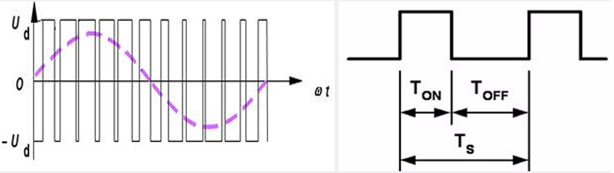

占空比变大，输出的能量提高，通过阻容变换电路所得到的平均电压值也变大；

占空比变小，输出的电压信号的平均值降低，通过阻容变换电路所得到的平均电压值也下降。

比如, 一个电灯只有**开**和**关**两个状态, 要怎么让它实现**50%亮度**的效果的呢? 只需要让它在一半时间**开**, 一半时间**关**, 交替执行这两个动作，只要频率足够高, 在人眼( 低通滤波器) 看起来就是**50%亮度**的样子了。


## PWM 频率设计参考依据

[STM32 Motor COntrol](http://www.emcu.it/STM32/STM32-MotorControl/STM32-MotorControl.html#Presentation_of_the_FOC_controller)


如何考虑极对数，将转速（RPM）转换为每相必须产生的正弦电流频率。

假设有一个三相电机，转速为 20000 转/分钟，这意味着每分钟有 20000 个（机械）转数。并且假设该电机有 4 个极对数。

计算机械频率（MF）的公式为：

MF = rpm/60，所以 20000 rpm 意味着每分钟（机械）转数 => 20000/60 = 333.33 次/秒（机械频率）。

要计算电频率（Hz），需要将机械频率乘以极对数的数量。

Hz = MF x 极对数，所以 333.33 x 4 = 1333.33 Hz。

这就是每相必须产生的正弦电流的频率。

但是......

正弦波必须至少达到（Nyquist Sampling Theorem 奈奎斯特采样定理规定的）两倍频率，但众所周知，这并不够......我们说至少需要达到 10-12 倍（越大越好），以获得曲线的精确重构......PWM 频率是我们的采样频率（在矢量控制每个 PWM 周期都进行的情况下）。

因此，PWM 频率为：

Fpwm >= 1333.33 x 12 = 16 KHz。

请注意，16 KHz 是最小条件。【取 20KHz】

如果可能的话，建议：提高频率，但要注意开关损耗。

- 14 电机 D52：转速 2400r/min，极对数 3：
  MF = 2400 / 60 = 40 次/秒
  Hz = MF _ 极对数 = 40 _ 3 = 120 Hz
  Fpwm >= 120 \* 12 = 1440 Hz = 1.5 KHz【取 5KHz】

## 死区时间计算

死区时间 DT 取决于：1、IO 引脚翻转延迟；2、MOS 管通断延时

IO 引脚翻转速率：GPIO_Speed = 50MHz : t1 = 1 / 50MHz = 0.00000002 s = 20 ns

MOS 管型号 NTMFS5C410NLT1G：

接通延时时间 Turn−On Delay Time ($t_{d(ON)}$) = 20 ns

关断延时时间 Turn−Off Delay Time ($t_{d(OFF)}$) = 66 ns

DT = 20 + 66 + 20 = 106 ns【取 200ns】

1. 确定 时间 $t_{DTS}$ 的值 （TIM1 和 TIM8 控制寄存器 1 TIMx_CR1，pg.233）
   位 9:8 时钟分频因子 CKD[1:0]

   - 为 00： $2^{CKD[1:0]}$ ，即 $2^0 = 1$ （1 分频）， $t_{DTS} = t_{CK\_INT}$ ，时间 $t_{CK\_INT} = \frac{1}{f_{CK\_INT}}$ ，时钟源频率 $f_{CK\_INT}$
   - 为 01： $2^{CKD[1:0]}$ ，即 $2^1 = 2$ （2 分频）， $t_{DTS} = 2 t_{CK\_INT}$
   - 为 10： $2^{CKD[1:0]}$ ，即 $2^2 = 4$ （4 分频）， $t_{DTS} = 4 t_{CK\_INT}$

2. 判断 DTG[7:5] （TIM1 和 TIM8 刹车和死区寄存器 TIMx_BDTR，pg.249），选择死区时间计算公式
   位 7:0 死区发生器设置 DTG[7:0]

   - 为 0xx： $DT = DTG[7:0] * T_{dtg}$ ， $T_{dtg} = t_{DTS}$
   - 为 10x： $DT = (64 + DTG[5:0]) * T_{dtg}$ ， $T_{dtg} = 2 * t_{DTS}$
   - 为 110： $DT = (32 + DTG[4:0]) * T_{dtg}$ ， $T_{dtg} = 8 * t_{DTS}$
   - 为 111： $DT = (32 + DTG[4:0]) * T_{dtg}$ ， $T_{dtg} = 16 * t_{DTS}$

3. 代入选择的公式计算

   - 以 STM32F1 为例，时钟源频率为 72MHz，以 1 分频为例：
     $t_{DTS} = \frac{1}{f_{CK\_INT}} = \frac{1}{72000000} = 1.388e-8 s = 13.89 ns$

   - $DTG[7:0] = 1111 1010 $ ，(十进制 250，十六进制 0xFA) ，其[7:5]位为 111，选择计算公式 4，其[4:0]位为 11010 ，(十进制 26)

     $T_{dtg} = 16 * t_{DTS} = 16 * 13.89$
     $DT = (32 + DTG[4:0]) * T_{dtg} = (32 + 26) * 16 * 13.89 = 12889.92 ns = 12.88992 us$

若 $DTG[7:0] = 0110 0100 $ ，(十进制 100，十六进制 0x64) ，其[7:5]位为 011，选择计算公式 1：

 $DT = DTG[7:0] * T_{dtg} = 100 * 13.89 = 1389 ns = 1.389 us$

若 $DTG[7:0] = 1001 0110 $ ，(十进制 150，十六进制 0x96) ，其[7:5]位为 100，选择计算公式 2 ，其[5:0]位为 010110，(十进制 22)：

 $DT = (64 + DTG[5:0]) * T_{dtg} = (64 + 22) * 2 * 13.89 = 2389.08 ns = 2.38908 us$

若 $DTG[7:0] = 0101 0000 $ ，(十进制 80，十六进制 0x50) ，其[7:5]位为 010，选择计算公式 1：

 $DT = DTG[7:0] * T_{dtg} = 80 * 13.89 = 1111.2 ns = 1.1112 us$

若 $DTG[7:0] = 0011 1100 $ ，(十进制 60，十六进制 0x3C) ，其[7:5]位为 001，选择计算公式 1：

 $DT = DTG[7:0] * T_{dtg} = 60 * 13.89 = 833.4 ns = 0.8334 us$

若 $DTG[7:0] = 0001 1110 $ ，(十进制 30，十六进制 0x1E) ，其[7:5]位为 000，选择计算公式 1：

 $DT = DTG[7:0] * T_{dtg} = 30 * 13.89 = 416.7 ns = 0.4167 us$

若 $DTG[7:0] = 0000 1111 $ ，(十进制 15，十六进制 0x0F) ，其[7:5]位为 000，选择计算公式 1：

 $DT = DTG[7:0] * T_{dtg} = 15 * 13.89 = 208.35 ns = 0.20835 us$

## 输出比较通道

通用：《STM32F10xxx 参考手册\_10_zh》P266 图 125 捕获/比较通道的输出部分(通道 1)

高级：《STM32F10xxx 参考手册\_10_zh》P214 图 78 捕获/比较通道的输出部分(通道 1 至 3)

## 输出比较模式

| 模式             | 描述                                                                                                                              |
| ---------------- | --------------------------------------------------------------------------------------------------------------------------------- |
| 冻结             | CNT=CCR 时，REF 保持为原状态                                                                                                      |
| 匹配时置有效电平 | CNT=CCR 时，REF 置有效电平                                                                                                        |
| 匹配时置无效电平 | CNT=CCR 时，REF 置无效电平                                                                                                        |
| 匹配时电平翻转   | CNT=CCR 时，REF 电平翻转                                                                                                          |
| 强制为无效电平   | CNT 与 CCR 无效，REF 强制为无效电平                                                                                               |
| 强制为有效电平   | CNT 与 CCR 无效，REF 强制为有效电平                                                                                               |
| PWM 模式 1       | 向上计数：CNT<CCR 时，REF 置有效电平，CNT≥CCR 时，REF 置无效电平 向下计数：CNT>CCR 时，REF 置无效电平，CNT≤CCR 时，REF 置有效电平 |
| PWM 模式 2       | 向上计数：CNT<CCR 时，REF 置无效电平，CNT≥CCR 时，REF 置有效电平 向下计数：CNT>CCR 时，REF 置有效电平，CNT≤CCR 时，REF 置无效电平 |

冻结、强制为无效电平、强制为有效电平 类似

## PWM 基本结构

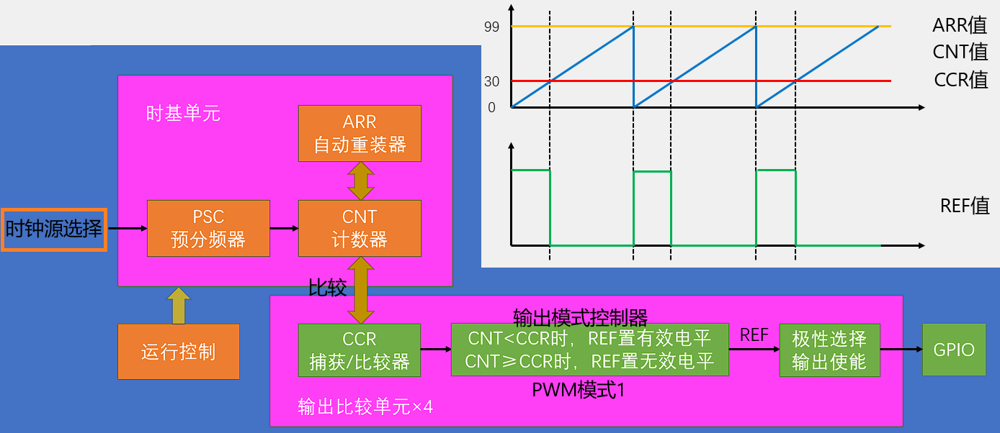

## 输入捕获简介

IC（Input Capture）输入捕获

输入捕获模式下，当通道输入引脚出现指定电平跳变时，当前 CNT 计数器的值将被锁存到 CCR 输入捕获寄存器中，可用于测量 PWM 波形的频率、占空比、脉冲间隔、电平持续时间等参数

每个高级定时器和通用定时器都拥有 4 个输入捕获通道

可配置为 PWMI 模式，同时测量频率和占空比

可配合主从触发模式，实现硬件全自动测量

## 频率测量

测频法：在闸门时间 T 内，对上升沿计次 N，则频率 fx = N / T

 适合测量高频信号，测量结果更新的慢，数值相对稳定（闸门时间 T 内的平均频率）

测周法：两个上升沿内，以标准频率 fc 计次 N，则频率 fx = fc / N

 适合测量低频信号，测量结果更新的快，数值跳变快

中界频率：测频法与测周法误差相等的频率点 fm = √(fc / T)

 当待测信号频率 < 中界频率时，测周法误差更小

 当待测信号频率 > 中界频率时，测频法误差更小


计次可能出现 ±1 误差（测频法、测周法 固有误差），当计次 N 较大时， ±1 误差对计次 N 的影响越小

测频法时，最后计次到一半，闸门时间 T 结束，将舍弃或者当作 1 个上升沿处理；

测周法时，最后计次到一半，标准频率 fc 才经过一半，将舍弃或者当作 1 个标准频率 fc 处理。

## 输入捕获通道

《STM32F10xxx 参考手册\_10_zh》P266 图 123 捕获/比较通道（如：通道 1 输入部分）

## 主从触发模式

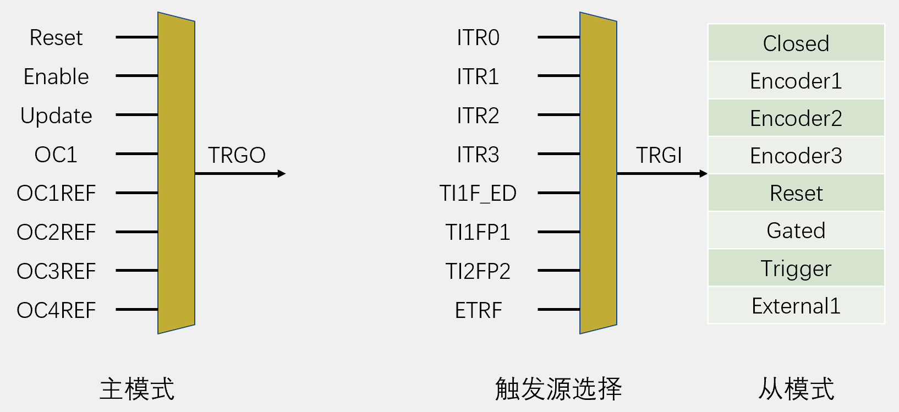

## 输入捕获基本结构

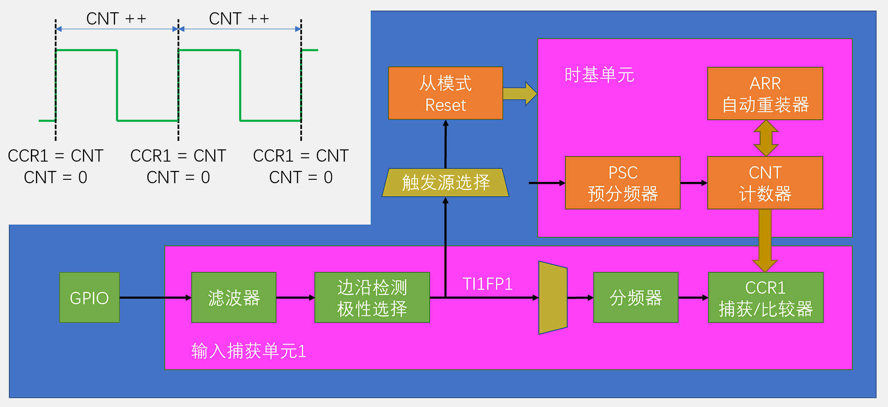

TI1FP1 配置上升沿触发 CCR1 输入捕获寄存器和复位清零 CNT 计数器，直到下一次上升沿触发 CCR1 输入捕获寄存器和复位清零 CNT 计数器，此时 CCR1 = CNT 从第一次上升沿到下一次上升沿的计数值，即一个周期的计数值

## PWMI 基本结构

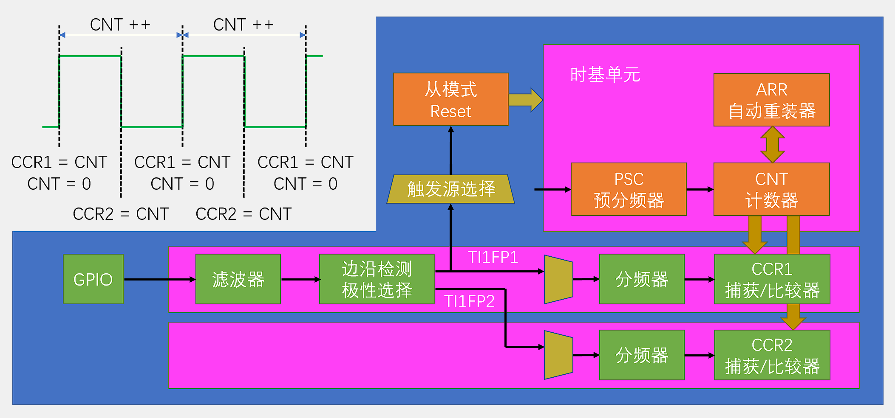

TI1FP1 配置上升沿触发 CCR1 输入捕获寄存器和复位清零 CNT 计数器，直到下一次上升沿触发 CCR1 输入捕获寄存器和复位清零 CNT 计数器，此时 CCR1 = CNT 从第一次上升沿到下一次上升沿的计数值，即一个周期的计数值

TI1FP2 配置下降沿触发，通过交叉通道，触发通道 2 的 CCR2 输入捕获寄存器，此时 CCR2 = CNT 从上升沿到下降沿的计数值，即高电平的计数值

## 编码器接口简介

Encoder Interface 编码器接口

编码器接口可接收增量（正交）编码器的信号，根据编码器旋转产生的正交信号脉冲，自动控制 CNT 自增或自减，从而指示编码器的位置、旋转方向和旋转速度

每个高级定时器和通用定时器都拥有 1 个编码器接口

两个输入引脚借用了输入捕获的通道 1 和通道 2

## 正交编码器


一般有两个信号输出引脚，一个是 A 相，一个是 B 相

方波的频率代表旋转轴的速度，可测量任意一相来获得

正转：A 相提前 B 相 90°

反转：A 相滞后 B 相 90°

## 编码器接口基本结构


## 工作模式

《STM32F10xxx 参考手册\_10_zh》P274 表 77 计数方向与编码器信号的关系

正转时，都向上计数
反转时，都向下计数


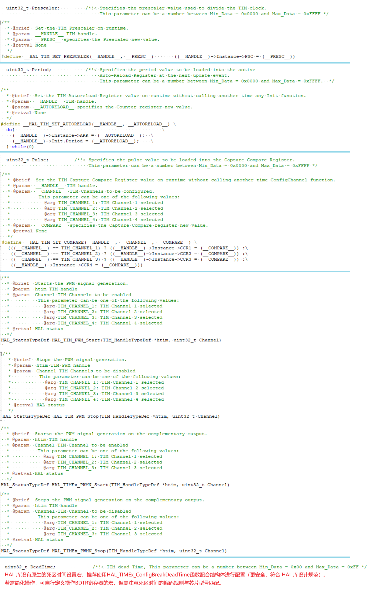 

# 第 8 章 模拟/数字转换 (ADC)

## 8.1 ADC 简介

ADC（Analog-Digital Converter）模拟-数字转换器

ADC 可以将引脚上连续变化的模拟电压转换为内存中存储的数字变量，建立模拟电路到数字电路的桥梁

12 位逐次逼近型 ADC，1us 转换时间

分辨率为 12 位，转换时间为 1us

输入电压范围：0\~3.3V，转换结果范围：0\~4095

18 个输入通道，可测量 16 个外部和 2 个内部信号源

规则组和注入组两个转换单元

模拟看门狗自动监测输入电压范围

STM32F103C8T6 ADC 资源：ADC1、ADC2，10 个外部输入通道

## 8.2 逐次逼近型 ADC

ADC0809 芯片原理图


## 8.3 ADC 框图

《STM32F10xxx 参考手册\_10_zh》P156 图 24 单个 ADC 框图

## 8.4 ADC 基本结构

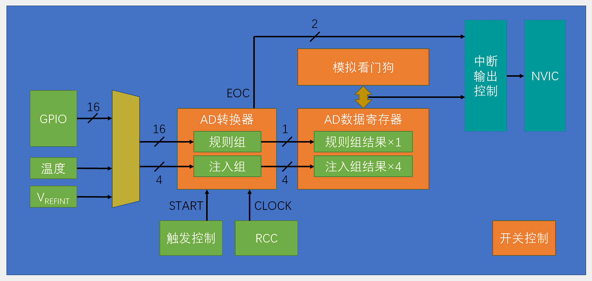

## 8.5 输入通道

| 通道    | ADC1         | ADC2 | ADC3 |
| ------- | ------------ | ---- | ---- |
| 通道 0  | PA0          | PA0  | PA0  |
| 通道 1  | PA1          | PA1  | PA1  |
| 通道 2  | PA2          | PA2  | PA2  |
| 通道 3  | PA3          | PA3  | PA3  |
| 通道 4  | PA4          | PA4  | PF6  |
| 通道 5  | PA5          | PA5  | PF7  |
| 通道 6  | PA6          | PA6  | PF8  |
| 通道 7  | PA7          | PA7  | PF9  |
| 通道 8  | PB0          | PB0  | PF10 |
| 通道 9  | PB1          | PB1  |      |
| 通道 10 | PC0          | PC0  | PC0  |
| 通道 11 | PC1          | PC1  | PC1  |
| 通道 12 | PC2          | PC2  | PC2  |
| 通道 13 | PC3          | PC3  | PC3  |
| 通道 14 | PC4          | PC4  |      |
| 通道 15 | PC5          | PC5  |      |
| 通道 16 | 温度传感器   |      |      |
| 通道 17 | 内部参考电压 |      |      |

## 8.6 转换模式

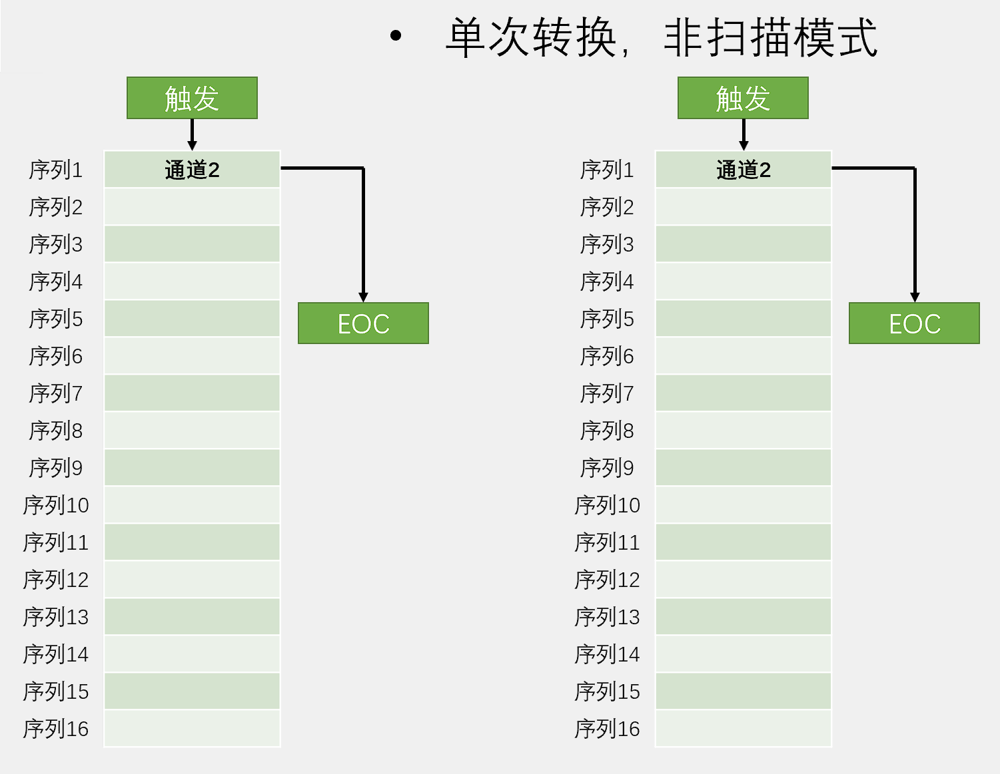

在单次转换，非扫描模式下，规则组只有序列 1 的位置有效

指定转换的通道，触发转换，等待一段时间，转换完成后，将结果放在数据寄存器里，同时给 EOC 标志位置 1。

判断 EOC 为 1，可在数据寄存器里读取转换结果。

如果想再启动一次转换，那就需要再触发一次，转换结束，置 EOC 标志位，读结果

如果想换一个通道，在转换前，将序列 1 位置改为其他通道，再启动转换


在连续转换，非扫描模式下，规则组只有序列 1 的位置有效

指定转换的通道，触发转换，在一次转换完成后，不会停止，而是立刻开始下一轮的转换，一直持续下去。

只需开始触发一次就可一直转换了，优点是开始转换后不需要等待一段时间，不需要手动开始转换，也不需要判断是否结束，直接读数据寄存器的 AD 值即可


在单次转换，扫描模式下，规则组有多个序列的位置有效

指定通道数目，指定任意转换的通道，可以重复，触发转换，对指定通道数目的序列进行转换，等待一段时间，转换完成后，将结果放在数据寄存器里，同时给 EOC 标志位置 1，为了防止数据被覆盖，需及时使用 DMA 将数据挪走。

判断 EOC 为 1，可在数据寄存器里读取转换结果。

如果想再启动一次转换，那就需要再触发一次，转换结束，置 EOC 标志位，读结果

如果想换一个通道，在转换前，将序列 1 位置改为其他通道，再启动转换

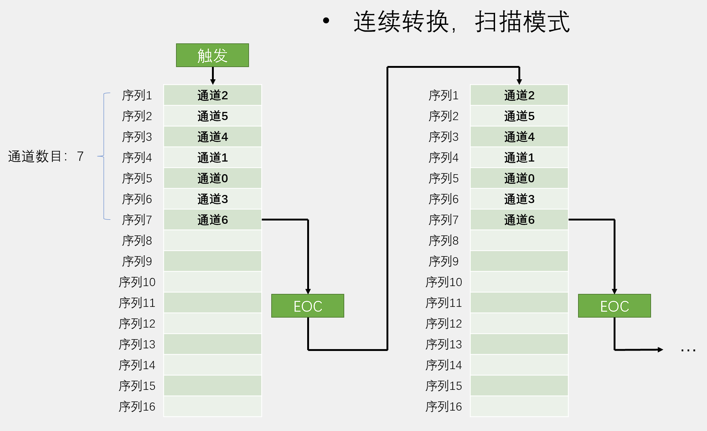

在连续转换，扫描模式下，规则组有多个序列的位置有效

指定通道数目，指定任意转换的通道，可以重复，触发转换，在一次转换完成后，不会停止，而是立刻开始下一轮的转换，一直持续下去。

只需开始触发一次就可一直转换了，优点是开始转换后不需要等待一段时间，不需要手动开始转换，也不需要判断是否结束，直接读数据寄存器的 AD 值即可

## 8.7 触发控制

《STM32F10xxx 参考手册\_10_zh》P162 表 64 ADC1 和 ADC2 用于规则通道的外部触发

用 AFIO 重映射来确定 外部引脚 或者 来自片上定时器的内部信号

## 8.8 数据对齐

《STM32F10xxx 参考手册\_10_zh》P161 图 29 数据右对齐、图 30 数据左对齐

ADC 的分辨率是 12 位，转换结果是 12 位的数据

但 数据寄存器是 16 位的，需要进行数据对齐

一般使用数据右对齐，直接读取 16 位数据寄存器，得到转换结果。

使用数据左对齐，直接读取 16 位数据寄存器，得到的结果比实际大，是把数据左移 4 次，把结果乘以 16

数据左对齐用于降低分辨率，取出高 8 位，舍弃后 4 位，将 12 位精度的 ADC 退化成 8 位精度

## 8.9 转换时间

AD 转换的步骤：采样，保持，量化，编码

 采样保持放一起，量化编码放一起，总共需两大步

STM32 ADC 的总转换时间为：

 TCONV = 采样时间 + 12.5 个 ADC 周期

 采样时间 是采样保持所需的时间，采样时间越大，越能避免一些毛刺信号的干扰，不过转换时间也会响应延长

 12.5 个 ADC 周期 是量化编码所需的时间，因为是 12 位分辨率的 ADC。ADC 周期是从 RCC 分频得到的 ADCCLK，最大是 14MHz

例如：当 ADCCLK=14MHz，采样时间为 1.5 个 ADC 周期

TCONV = 1.5 + 12.5 = 14 个 ADC 周期 = 1μs

## 8.10 校准

ADC 有一个内置自校准模式。校准可大幅减小因内部电容器组的变化而造成的准精度误差。校准期间，在每个电容器上都会计算出一个误差修正码(数字值)，这个码用于消除在随后的转换中每个电容器上产生的误差

建议在每次上电后执行一次校准

启动校准前， ADC 必须处于关电状态超过至少两个 ADC 时钟周期

## 8.11 硬件电路


第一个是电位器产生可调电压的电路

 电位器的两个固定端，一端接 3V3，一端接 GND，中间滑动可调电压的范围就为 0~3.3V，可接 ADC 的输入通道 PA0，当滑动端往上滑时，电压增大，往下滑时，电压减小

 注意：电阻阻值不能太小，因为电阻两端直接跨接在电源正负极之间的，若电阻阻值太小，那这个电阻会比较费电，可能发热冒烟烧毁，至少接 KΩ 级的电阻

第二个是传感器输出电压的电路

 一般有光敏电阻、热敏电阻、红外接收管、麦克风等可等效为一个可变电阻，没法直接测量其电阻阻值，可与一个固定电阻串联分压，得到一个反应电阻值电压的电路，固定电阻选择与传感器阻值相近的电阻，这样可得到一个位于中间电压区域比较好的输出，固定电阻与传感器电阻交换位置，则输出电压的极性就反过来

 传感器阻值变小时，下拉作用变强，输出端电压下降

 传感器阻值变大时，上拉作用变强，输出端电压升高

第三个是简单的电压转换电路

 比如想测 0\~5V 的 VIN 电压，但 ADC 只能接收 0\~3.3V 的电压，使用电阻分压，中间的输出端电压 = VIN / (17K + 33K) \*33K，电压范围就为 0~3.3V

 该电路可用于采集 5V、10V 的电压，如果电压再高些，不建议使用该电路，可能较危险，高电压采集最好使用专用的采集芯片，比如隔离放大器等，做好高低电压的隔离，保证电路的安全

# 第 9 章 直接存储器存取 (DMA)

## 9.1 DMA 简介

DMA（Direct Memory Access）直接存储器存取

DMA 可以提供外设和存储器或者存储器和存储器之间的高速数据传输，无须 CPU 干预，节省了 CPU 的资源

12 个独立可配置的通道： DMA1（7 个通道）， DMA2（5 个通道）

每个通道都支持软件触发和特定的硬件触发

STM32F103C8T6 DMA 资源：DMA1（7 个通道）

## 9.2 存储器映像

| 类型 | 起始地址    | 存储器           | 用途                             |
| ---- | ----------- | ---------------- | -------------------------------- |
| ROM  | 0x0800 0000 | 程序存储器 Flash | 存储 C 语言编译后的程序代码      |
| ROM  | 0x1FFF F000 | 系统存储器       | 存储 BootLoader，用于串口下载    |
| ROM  | 0x1FFF F800 | 选项字节         | 存储一些独立于程序代码的配置参数 |
| RAM  | 0x2000 0000 | 运行内存 SRAM    | 存储运行过程中的临时变量         |
| RAM  | 0x4000 0000 | 外设寄存器       | 存储各个外设的配置参数           |
| RAM  | 0xE000 0000 | 内核外设寄存器   | 存储内核各个外设的配置参数       |

## 9.3 DMA 框图

《STM32F10xxx 参考手册\_10_zh》 P143 图 21 DMA 框图

## 9.4 DMA 基本结构

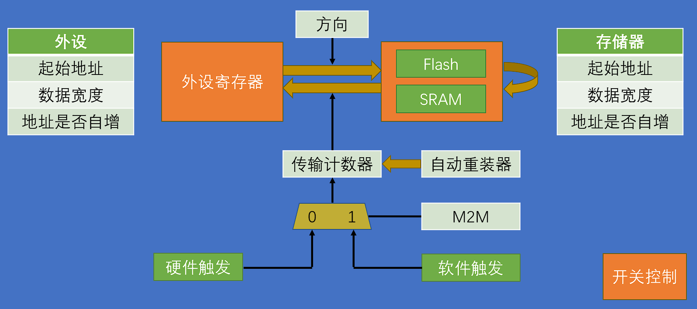

## 9.5 DMA 请求

《STM32F10xxx 参考手册\_10_zh》 P147 图 22 DMA1 请求映像

## 9.6 数据宽度与对齐

《STM32F10xxx 参考手册\_10_zh》 P145 表 57 可编程的数据传输宽度和大小端操作 (当 PINC = MINC = 1)

## 9.7 数据转运+DMA


## 9.8 ADC 扫描模式+DMA

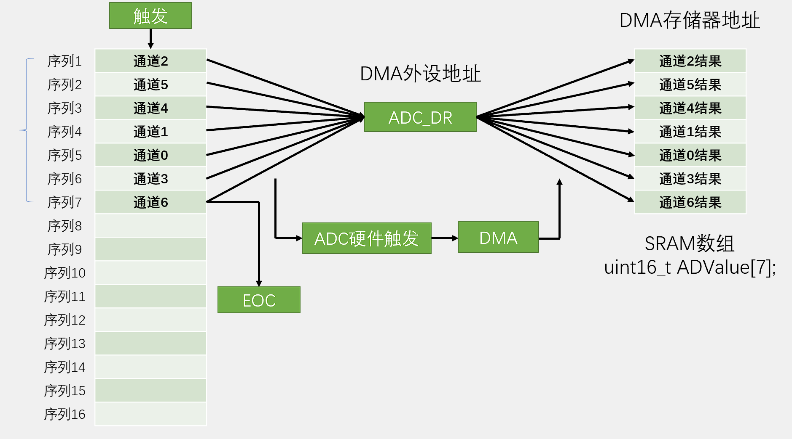

# 第 10 章 串口通信 (USART)

## 10.1 通信接口

目的：将一个设备的数据传送到另一个设备，扩展硬件系统

通信协议：制定通信的规则（软、硬件），通信双方按照协议规则进行数据收发

## 10.2 STM32 支持的通信协议

| 名称  | 引脚                                                                                                                                                                                                      | 双工   | 时钟 | 电平 | 设备   |
| ----- | --------------------------------------------------------------------------------------------------------------------------------------------------------------------------------------------------------- | ------ | ---- | ---- | ------ |
| USART | Transmit Exchange (TX) 数据发送<br />Receive Exchange (RX) 数据接收<br />GND 接地<br />VCC 电源正极                                                                                                       | 全双工 | 异步 | 单端 | 点对点 |
| I2C   | Serial Clock (SCL) 时钟<br />Serial Data (SDA) 数据<br />GND 接地<br />VCC 电源正极                                                                                                                       | 半双工 | 同步 | 单端 | 多设备 |
| SPI   | Serial Clock (SCLK) 时钟<br />Master Output Slave Input (MOSI) 主机输出数据<br />Master Input Slave Output (MISO) 主机输入数据<br />Chip Select (CS) 片选(指定通信的对象)<br />GND 接地<br />VCC 电源正极 | 全双工 | 同步 | 单端 | 多设备 |
| CAN   | CAN_H、CAN_L 差分数据                                                                                                                                                                                     | 半双工 | 异步 | 差分 | 多设备 |
| USB   | DP、DM<br />或 D+、D- Data Positive、Data Minus 差分数据、接地                                                                                                                                            | 半双工 | 异步 | 差分 | 点对点 |

名词解释

双工：

- 全双工：通信双方可同时进行双向通信（一般有两根数据收发线）
- 半双工：通信双方可双向通信，但必须分时复用一根数据线（一般只有一根数据收发线，差分线有两根一起组成一根数据收发线）
- 单工：通信只能有一方发送到另一方，不能反向传输
  USART 取消数据发送线或数据接收线，就变成了单工

时钟：

- 异步：通信双方各自约定通信速率
- 同步：通信双方靠一根时钟线来约定通信速率 (有时钟线 SCL)

电平：

- 单端：引脚的高低电平是对 GND 的电压差（通信双方必须共地）
- 差分：靠两个差分数据引脚的电压差来传输数据（不需要接地）
  但 USB 协议中有些地方需要单端信号，所以 USB 需要接地
  差分信号可极大地提高抗干扰特性，其传输速度和距离都非常高，性能也不错

 电平标准是数据 1 和数据 0 的表达方式，是传输线缆中人为规定的电压与数据的对应关系，串口常用的电平标准有如下三种：

 TTL 电平：+3.3V 或+5V 表示 1，0V 表示 0

 RS232 电平：-3\~-15V 表示 1，+3\~+15V 表示 0 （大型机器上使用）

 RS485 电平：两线压差+2\~+6V 表示 1，-2\~-6V 表示 0 （差分信号） (可以传输远距离的信号)

设备：

- 点对点：两个设备之间
- 多设备：在总线上挂载多个设备，需要有寻址的过程，以确定通信的对象，

- 总线：连接各个设备的数据传输线路（类似于一条马路，把路边各住户连接起来，使住户可以相互交流）

## 10.3 串口通信

串口是一种应用非常广泛的通信接口，成本低，易使用，通信线路简单，可实现两个设备互相通信

单片机的串口可以使单片机与单片机、**单片机与电脑**、单片机与各式各样的模块互相通信，极大的扩展了单片机的应用范围，增强了单片机系统的硬件实力

**单片机与电脑互相通信，非常适合调试程序，打印信息** ，I2C、SPI 等一般用于芯片之间的通信，不会接到电脑上

常用串口通信模块

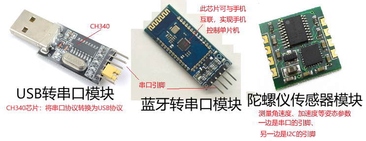

### 10.3.1 硬件电路

简单双向串口通信有两根通信线（发送端 TXD 和接收端 RXD）

TXD 与 RXD 要交叉连接

当只需单向的数据传输时，可以只接一根通信线

当电平标准不一致时，需要加电平转换芯片


TX、RX 是单端信号，其高低电平是相对于 GND 的，所以串口通信的 TX、RX、GND 是必须要接的

若两个设备都有独立供电，可不接 VCC

### 10.3.2 串口参数及时序图

- 波特率：串口通信的速率（发送和接收各数据位的间隔时间）
  波特率：每秒传输的码元数，单位：码元/秒，波特，Baud
  比特率：每秒传输的比特数，单位：比特/秒，bit/s，bps
  在二进制调制时，码元=bit，波特率=比特率
  9600 波特率：每秒传输 9600 位——1 位=1/9600 秒=0.1ms
  115200 波特率：每秒传输 115200 位——1 位=1/115200 秒=8.7us
- 起始位：标志一个数据帧的开始，固定为低电平
- 数据位：数据帧的有效载荷，1 为高电平，0 为低电平，低位先行
  0000 1111，从低位向高位发送，先发送最右位的 1

 有两种表示方法，一种是把校验位作为数据位的一部分，分为 8 位数据（8 位数据位+无校验）和 9 位数据（8 位数据位+奇/偶校验位）；

 另一种是把数据位与校验位独立开，校验位是独立的 1 位

- 校验位：用于数据验证，根据数据位计算得来 （可选 3 种校验方式：无校验、奇校验、偶校验）
  校验位由发送方来计算并发送，由接收方来接受并验证

 例如：双方约定采用奇校验
​ 发：0000 0011 1 (8 位数据+1 位校验) 发出数据为偶数个 1，为了保证奇校验，在检验位补 1，则变为奇数个 1
​ 收：0000 0011 1 则数据正确
​ 0000 0101 1 但这种就校验不出来了，收方也会认为数据正确

 发：1110 0000 0 发出数据为奇数个 1，检验位不用补 1 凑奇数个 1
​ 收：1100 0000 0 收到数据为偶数个 1，**接收方验证**数据有误，进行下一步操作，可选择丢弃或要求重传

奇偶校验是比较基础的一种校验方式，CRC 校验可提高检出率，STM32 有 CRC 外设

- 停止位：用于数据帧间隔，固定为高电平
- 空闲：没有数据传输的状态，固定为高电平

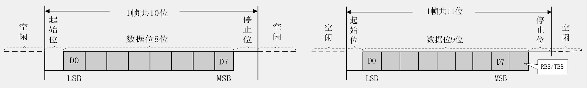

### 10.3.3 串口通信的实际波形演示

使用示波器实测，将探头的 GND 接在负极，探头接在发送设备的 TX 引脚

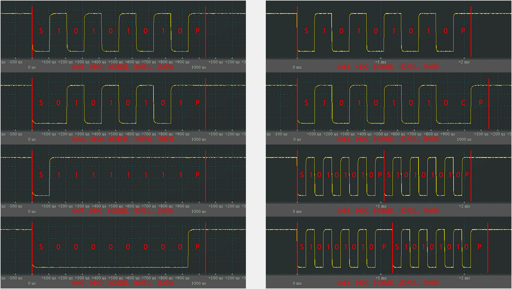

### 10.3.4 总结

TX 引脚发送定时翻转的高低电平，RX 引脚定时读取引脚的高低电平，每个字节的数据加上起始位、停止位、可选的校验位，依次输出在发送端的 TX 引脚，接受端的 RX 引脚依次接收，完成字节数据的传输

## 10.4 USART 简介

Universal Synchronous Asynchronous Receiver Transmitter，通用同步异步收发器

UART：通用异步收发器

同步模式：增加时钟输出线 CK，只支持时钟输出，不支持时钟输入，兼容其他协议或特殊用途而设计，不支持两个设备进行同步通信

所以使用串口主要是异步通信

USART 是 STM32 内部集成的硬件外设，可根据数据寄存器的一个字节数据自动生成数据帧时序，从 TX 引脚发送出去，也可自动接收 RX 引脚的数据帧时序，拼接为一个字节数据，存放在数据寄存器里

自带波特率发生器，最高达 4.5Mbits/s

 波特率发生器：用来配置波特率，是一个分频器，将时钟频率分频为需要的波特率时钟

可配置数据位长度（8/9）、停止位长度（0.5/1/1.5/2）

可选校验位（无校验/奇校验/偶校验）

支持同步模式、硬件流控制、DMA、智能卡、IrDA、LIN

 硬件流控制：例如 A 设备的 TX 要向 B 设备的 RX 发送数据，但是 B 处理不过来，只能抛弃新数据或覆盖原数据，使用硬件流控制，在硬件电路上多接一根线，若 B 没准备好，就置高电平，如果准备好了，就置低电平，A 接收到 B 反馈的准备信息，就只会在 B 准备好时，才发送数据。可防止接受端处理慢而导致数据丢失。

 DMA：串口支持 DMA 进行数据转运，用于大量数据进行收发时，减轻 CPU 的负担

 智能卡、IrDA、LIN：其他通信协议，类似串口协议，STM32 就对 USART 进行了一些小的改动，可兼容这些协议

STM32F103C8T6 USART 资源： USART1、 USART2、 USART3

 USART1_TX—复用功能—PA9—重映射—PB6

 USART1_RX—复用功能—PA10—重映射—PB7

 USART2_TX——PA2

 USART2_RX——PA3

 USART3_TX——PB10

 USART3_RX——PB11

作用：按照串口协议来产生和接收高低电平信号，实现串口通信

## 10.5 USART 框图

《STM32F10xxx 参考手册\_10_zh》 P518 图 248 USART 框图

芯片的 TX 引脚<——发送移位寄存器<——发送数据寄存器(TDR)<——写操作

芯片的 RX 引脚——>接收移位寄存器——>接收数据寄存器(RDR)——>读操作

TDR、RDR 两个数据寄存器占用同一个地址，跟 51 单片机串口的 SBUF 寄存器一样，在程序中只表现为一个数据寄存器 DR

硬件上分为两个数据寄存器，TDR 是只写用于发送，RDR 是只读用于接收

发送移位寄存器：把一个字节的数据一位一位的移出去（至 TX 引脚），对应串口协议时序图的数据位

接收移位寄存器：从 RX 引脚一位一位的接收数据

## 10.6 USART 工作流程

例如：给 TDR 写入 0x55 (0101 0101) ，再读取

写操作：

系统检查当前发送移位寄存器是否正在移位，若没有，0x55 (0101 0101) 立刻全部移动到发送移位寄存器，准备发送，

当数据从 TDR 移动到发送移位寄存器时，置一个标志位 TXE(TX Empty 发送数据寄存器 空)，检查该标志位，若 TXE 置 1，就可向 TDR 写入下一个数据，

 此时数据还没有从发送移位寄存器发送出去

发送器控制 驱动 发送移位寄存器 向右移位（低位先行），把数据发送到 TX 引脚

当数据移位完成后，新的数据会再次自动从 TDR 移动到发送移位寄存器，若当前发送移位寄存器数据移位还未完成，TDR 的数据进行等待，一但移位完成，立刻进行移动到发送移位寄存器

TDR 和发送移位寄存器的双重缓存，保证了连续发送数据时，数据帧之间不会空闲，提高工作效率

读操作：

数据从 RX 引脚通向接收移位寄存器，

接收器控制 驱动 接收移位寄存器 一位一位的读取 RX 电平，先放在最高位，然后向右移，移位 8 次后，接收到一个字节，整体立即转移到 RDR 中，转移过程中，置一个标志位 RXNE(RX Not Empty 接收数据寄存器 非空)，检查该标志位，若 RXNE 置 1，就可从 RDR 中读取数据

当数据从接收移位寄存器转移到 RDR 时，就可直接移位接收下一帧数据了

## 10.7 USART 基本结构

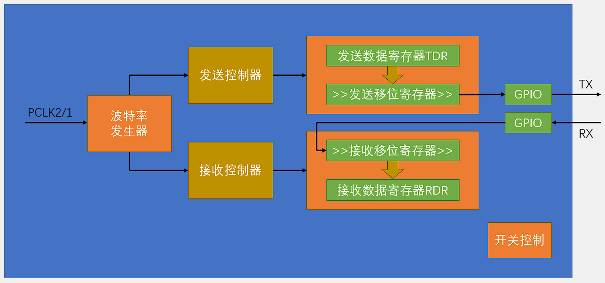

## 10.8 发送数据的数据帧

字长：数据位长度

时钟：同步时钟输出的功能，在每个数据位的中间，都有一个时钟信号上升沿，时钟的频率和数据的速率是一样的，接收端可在时钟上升沿进行采样，就可精准定位每一位数据，可通过..LBCL 位控制数据位的最后一位是否输出

空闲帧：从起始位到停止位整个传输流程都为 1（局域网协议使用，串口不使用）

断开帧：从起始位到停止位整个传输流程都为 0（局域网协议使用，串口不使用）

空闲：高电平

起始位：低电平

数据位：

校验位：

 对于 9 位字长，数据位从位 0 到位 8，可选择配置为 8 位有效载荷+1 位校验位（推荐）；也可选择 9 位有效载荷（不推荐）

 对于 8 位字长，数据位从位 0 到位 7，可选择配置位 8 位有效载荷（推荐）；也可选择 7 位有效载荷+1 位校验位（不推荐）

停止位：高电平

《STM32F10xxx 参考手册\_10_zh》 P519 图 249 字长设置

停止位的波形变化

STM32 串口可配置停止位的长度为 0.5、1、1.5、2 四种模式

1 个停止位的时长与数据位的时长一样

《STM32F10xxx 参考手册\_10_zh》 P520 图 250 配置停止位

## 10.9 接收数据的数据帧

《STM32F10xxx 参考手册\_10_zh》 P522 图 252 起始位侦测

当接收设备侦测到一个数据帧的起始位后，会以波特率的频率，连续采样一帧数据，从起始位开始，采样位置就要对齐到位的正中间，只要第一位对齐了，后面才能对齐

首先对采样时钟进行细分，以波特率的 16 倍频率进行采样，即在一个数据位的时间里，进行 16 次采样，

 空闲为高电平，采样一直是 1，在某个位置，采到 0，说明在这两次采样之间出现了下降沿，如果没有任何噪声，之后应该是起始位了，进行连续 16 次采样，理想采样应该都是 0，但实际电路会存在噪声，即使出现下降沿了，后续也会再采样几次，以防万一，

 接收电路会在下降沿之后的第 3 次、第 5 次、第 7 次进行一批采样，以及第 8、9、10 次再进行一批采样，且要求这两批采样中每 3 位里面至少应有 2 个 0，

 如果没有噪声，应该全是 0，

 如果有轻微噪声，导致这 3 位里面只有两个 0，另一个是 1，也算检测到了起始位，在状态寄存器里置一个 NE(Noise Error 噪声标志位) 为 1，提醒检测到接收数据的起始位，但通信电路中有噪声，注意分辨使用后续的数据

 如果这 3 位里面只有 1 个 0 ，就不算检测到了起始位，可能前面的下降沿是噪声导致的，此时接收电路忽略前面的下降沿，重新开始捕捉下降沿

如果通过了起始位侦测，接收状态就由空闲变为接收起始位，第 8、9、10 次采样的位置是起始位的正中间，之后接收数据位时，都在第 8、9、10 次进行采样，保证采样位置在数据位的正中间

数据采样的流程

《STM32F10xxx 参考手册\_10_zh》 P523 图 253 检测噪声的数据采样

由于已经在起始位侦测对齐了采样时钟，所以数据位采样直接在第 8、9、10 次采样数据位，为了保证数据的可靠性，连续采样 3 次

如果没有噪声干扰的话，应该全是数据信号（1 或者 0），全为 1 即接收到了 1，全为 0 即接收到了 0，

如果有噪声，导致 3 次采样不是全为 1 或者全为 0，按照 2：1 的规则来，2 次为 1 即接收到 1，2 次为 0 即接收到 0，并对 NE(Noise Error 噪声标志位) 置 1

## 10.10 波特率发生器

APB 时钟进行分频，得到发送和接收移位的时钟

时钟输入是 fPCLKx( x= 1, 2 ) ，比如 USART1 挂载在 APB2，这里时钟就是 fPCLK2，一般为 72MHz，其他的 USART 挂载在 APB1，时钟就是 fPCLK1，一般是 32MHz

然后对 fPCLKx 进行分频，除以分频系数 USARTDIV，有些波特率用 72MHz 除以整数是除不尽的会有误差，所以 USARTDIV 分为整数部分 DIV_Mantissa 和 小数部分 DIV_Fraction(支持小数点后 4 位，分频更加精确)

分频完后，再除以 16，得到发送器时钟 和 接收器时钟 通向 发送器控制 和 接收器控制

如果 TE(TX Enable) 为 1，表示发送器使能，发送部分的波特率就有效

如果 RE(RX Enable) 为 1，表示接收器使能，接收部分的波特率就有效

发送器和接收器的波特率由波特率寄存器 BRR 里的 DIV 确定

计算公式：波特率 = $\frac{ f_{PCLKx(x=1,2)} }{ 16*DIV }$

《STM32F10xxx 参考手册\_10_zh》 P542 25.6.3 波特比率寄存器 (USART_BRR)

## 10.11 硬件数据流控 （流控）

若发送设备发的太快，接收设备来不及处理，就会出现丢弃或覆盖数据的现象，使用流控，避免此问题

有两个引脚（n 表示低电平有效）：

nRTS (Request To Send 请求发送) 是输出引脚，用于告诉其他设备当前能不能接收

nCTS (Clear To Send 清除发送) 是输入引脚，用于接收其他设备 nRTS 的信号

接线：

两个设备都支持流控

设备 A 的 TX——>设备 B 的 RX

设备 A 的 nCTS<——设备 B 的 nRTS

工作流程：

当 B 能接收数据时，通过 nRTS 置低电平，请求 A 发送，A 的 nCTS 接收到低电平，就可一直发送

当 B 处理不过来时，比如接收数据寄存器一直没有读取，又有新的数据过来了，代表 B 没有及时处理，则 B 的 nRTS 置高电平，A 的 nCTS 接收到高电平，就会暂停发送，直到 B 的接收数据寄存器被读取，B 的 nRTS 置低电平，新的数据才会继续发送

## 10.12 SCLK 控制

用于产生同步的时钟信号，可兼容别的协议（串口+时钟输出，就类似 SPI 协议），还可做自适应波特率（比如接收设备不确定发送设备采用的是什么波特率，就可以测量发送设备发出的时钟周期，通过另外的程序计算得出波特率）

SCLK 引脚是配合发送移位寄存器输出信号的，发送移位寄存器每移位一次，同步时钟电平就跳变一个周期，时钟告诉接收设备，我方（发送方）发送了一个数据了，接收方可用这个时钟信号来指导接收数据

这个时钟只支持输出，不支持输入，所以两个 USART 之间不能实现同步的串口通信

## 10.13 唤醒单元

实现串口挂载多设备通信，每个设备分配一个 USART 地址，发送设备先进行寻址，确定通信对象，再进行数据发送

指定地址时，该设备被唤醒开始工作，没收到地址的设备就保持沉默

## 10.14 USART 中断控制

配置中断是否能通向 NVIC

中断申请位：状态寄存器中的各种标志位，有两个标志位比较重要，TXE、RXNE

## 10.15 串口发送及接收

### 10.15.1 硬件准备

驱动：CH340

接线图：


注意：

接线顺序：

 USB 转串口模块的 TXD——>STM32 的 RX

 USB 转串口模块的 RXD<——STM32 的 TX

 USB 转串口模块的 GND——STM32 的 GND（共地）

### 10.15.2 数据模式

HEX 模式、十六进制模式、二进制模式：以原始数据的形式显示（收到什么数据，就显示数据本身，显示的是十六进制数）

文本模式、字符模式：以原始数据编码后的形式显示（通过查找字符集，将原始数据编码成对应的字符）


ASCII 码是一种最简单、最常用的字符集

常用的汉字字符集有 GB2312、GBK、GB18030 等

Unicode 字符集所录了国际通用的字符，其最常用的传输形式是 UTF8

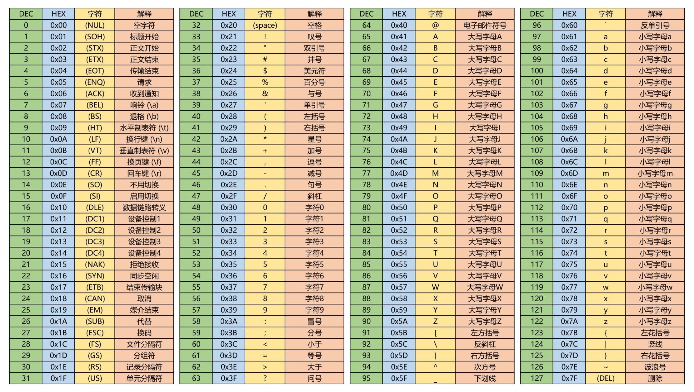

### 10.15.3 HEX 数据包

以数据本身呈现

作用：将单独的数据打包，方便多字节的数据通信

 例：陀螺仪传感器的数据，需用串口发送到 STM32，x、y、z 轴各一个数据，需连续不断的发送，当 xyz、xyz 这样连续发送时，接收方不知道哪个对应 x，哪个对应 y，哪个对应 z，可能会从任意位置开始接收，会出现数据错位的现象，此时，就需要将数据进行分割打包，再接收时，接收方就知道数据包的第一个数据是 x，第二个数据是 y，第三个数据是 z。

#### 定义格式

包头为 0xFF，包尾为 0xFE

- 固定包长，含包头包尾


- 可变包长，含包头包尾


注意：

1、包头包尾与载荷数据重复

解决方法：

 (1) 在发送数据时，对数据进行限幅（限制数据的范围，避开与包头包尾重复的数据）

 (2) 使用固定长度的数据包，只要通过包头包尾对齐了数据，就可知道包头包尾和载荷数据的位置，接收载荷数据时，不会判断是否为包头包尾，在接收包头包尾时，会判断是否为包头包尾，用于数据对齐

 (3) 增加包头包尾的数量，使其表现为载荷数据不会出现的状态

2、各种数据转换为字节流

想发送 16 位的整型数据、32 位的整型数据、float、double、结构体等（数据底层都是由字节组成的），只需用一个 uint8_t 的指针 指向它，把它们当作一个字节数组发送就行

#### 发送

定义一个数组

使用 Serial_SendArray

#### 接收

固定包长 HEX 数据的接收

每收到一个字节，程序会进一次中断，在中断函数里读取到这各字节，退出中断。所以每拿到一个数据，都是一个独立的过程

对于数据包，具有前后关联性，包头之后是数据，数据之后是包尾。对包头、数据、包尾这三种状态，都需要有不同的处理逻辑

在程序中需要设计一个能记住不同状态的机制，在不同状态执行不同的操作，同时进行状态的合理转移，这种程序设计的思维，叫作 “**状态机**”

状态转移图：

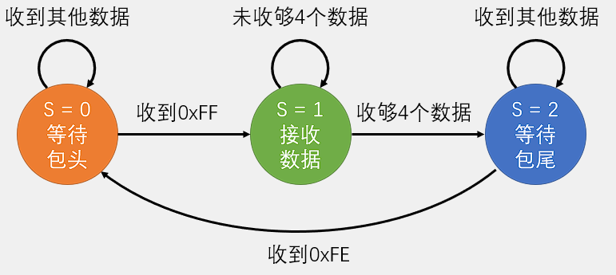

### 10.15.4 文本数据包

以数据编译和译码呈现

#### 定义格式

包头为 '@'，包尾为 '\r' '\n' （换行符）

- 固定包长，含包头包尾


- 可变包长，含包头包尾


#### 发送

写一个字符串

使用 Serial_SendString

#### 接收

可变包长文本数据包的接收

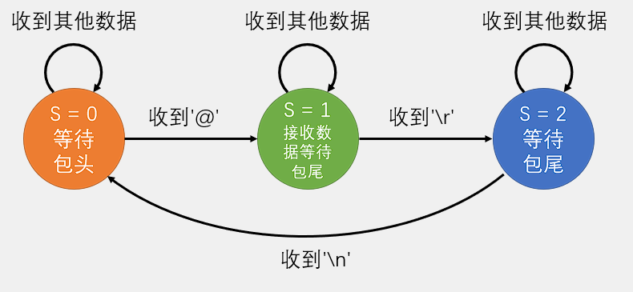

### 10.15.5 HEX 数据包、文本数据包对比

|      | HEX 数据包                                                   | 文本数据包                                                                          |
| ---- | ------------------------------------------------------------ | ----------------------------------------------------------------------------------- |
| 优点 | 数据传输最直接，数据解析非常简单                             | 数据显示直观易理解，传输灵活性高，包头包尾与载荷数据不容易重复                      |
| 缺点 | 传输灵活性不足，包头包尾与载荷数据容易重复                   | 数据解析效率低                                                                      |
| 应用 | 外设模块发送原始的数据，如使用串口通信的陀螺仪、温湿度传感器 | 输入指令进行人机交互的场合，如蓝牙模块常用的 AT 指令、CNC 和 3D 打印机常用的 G 代码 |

printf 打印函数乱码解决方法：

- 如果是 UTF-8（有些软件兼容性不好）

 串口助手也需选择 UTF-8 的文本编码方式
​ 有时程序中写中文会编译报错，需在魔术棒设置：C/C++——Misc Controls 填写：--no-multibyte-chars，点击 OK

- 切换为 GB2312 编码方式

 需删掉 汉字， 再关闭 文件， 再打开 文件，此时 文件字体会变为 宋体，此时切换完成，可输入 汉字，编译成功，下载后，在串口助手中 选择 GBK 编码，输出汉字

- 如果有大量工程已经选择了编码方式，可使用 UltraCodingSwitch.exe 软件 进行批量转换 编码方式

串口接收

对于串口接收，可使用查询、中断两种方式
查询方式
初始化完成后即可，不需要开启中断（如果开启中断再使用查询，变得很卡）
中断方式
初始化中，在 USART 使能前需要开启中断

# 第 11 章 IIC 通信

## 11.1 I2C 总线介绍

IIC 总线（Inter IC BUS）是由 Philips 公司开发的一种通用数据总线

两根通信线：SCL（Serial Clock）、SDA（Serial Data）

同步 (有时钟线)、半双工 (有 1 根数据线，负责发送、接受数据)

带数据应答 (发送者发送数据后要求接受者接受到后返回应答)

支持总线挂载多设备（一主多从、多主多从）

通用的 I2C 总线，可以使各种设备的通信标准统一，对于厂家来说，使用成熟的方案可以缩短芯片设计周期、提高稳定性，对于应用者来说，使用通用的通信协议可以避免学习各种各样的自定义协议，降低了学习和应用的难度

应用：

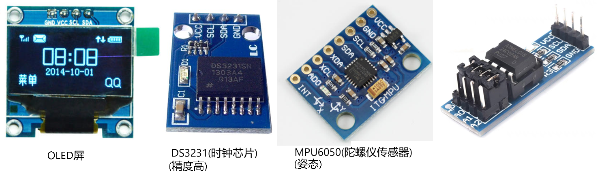

## 11.2 硬件电路

所有 I2C 设备的 SCL 连在一起，SDA 连在一起

设备的 SCL 和 SDA 均要配置成开漏输出模式

SCL 和 SDA 各添加一个上拉电阻，阻值一般为 4.7KΩ 左右

开漏输出和上拉电阻的共同作用实现了“线与”的功能，此设计主要是为了解决多机通信互相干扰的问题

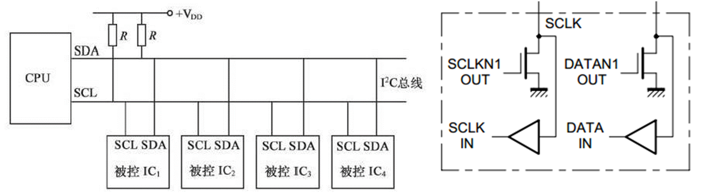

## 11.3 I2C 时序结构

起始条件：SCL 高电平期间，SDA 从高电平切换到低电平

终止条件：SCL 高电平期间，SDA 从低电平切换到高电平

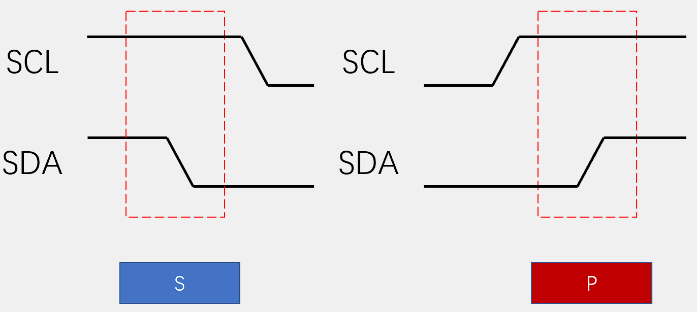

发送一个字节：SCL 低电平期间，主机将数据位依次放到 SDA 线上（高位先行），然后拉高 SCL，从机将在 SCL 高电平期间读取数据位，所以 SCL 高电平期间 SDA 不允许有数据变化，依次循环上述过程 8 次，即可发送一个字节

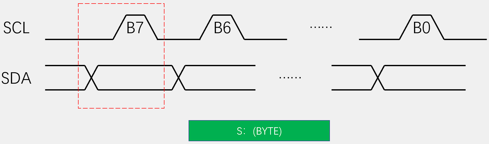

接收一个字节：SCL 低电平期间，从机将数据位依次放到 SDA 线上（高位先行），然后拉高 SCL，主机将在 SCL 高电平期间读取数据位，所以 SCL 高电平期间 SDA 不允许有数据变化，依次循环上述过程 8 次，即可接收一个字节（主机在接收之前，需要释放 SDA）

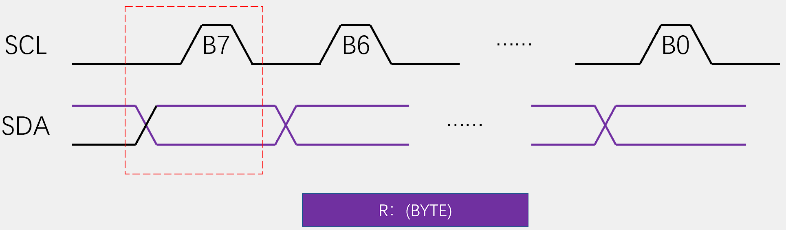

发送应答：主机在接收完一个字节之后，在下一个时钟发送一位数据，数据 0 表示应答，数据 1 表示非应答

接收应答：主机在发送完一个字节之后，在下一个时钟接收一位数据，判断从机是否应答，数据 0 表示应答，数据 1 表示非应答（主机在接收之前，需要释放 SDA）

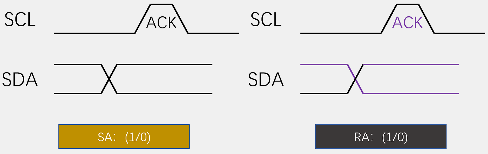

## 11.4 I2C 数据帧

- 发送一帧数据

  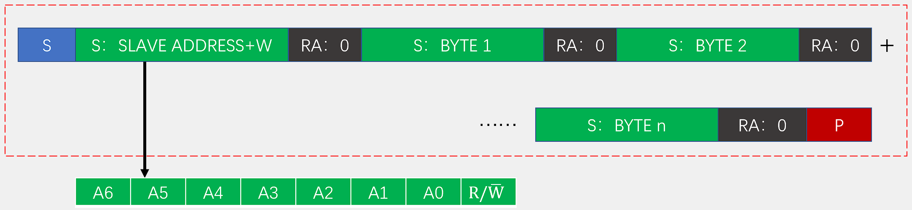

  完成任务：向谁发什么

- 接收一帧数据

  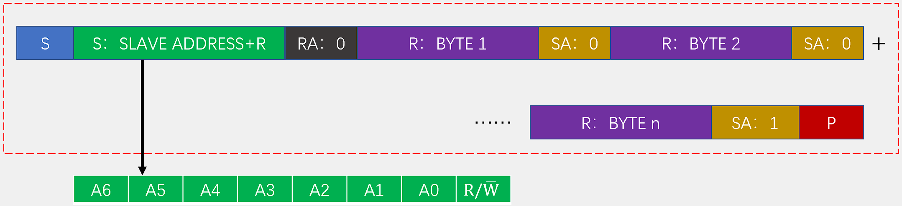

  完成任务：向谁收什么

- 先发送再接收数据帧（复合格式）

  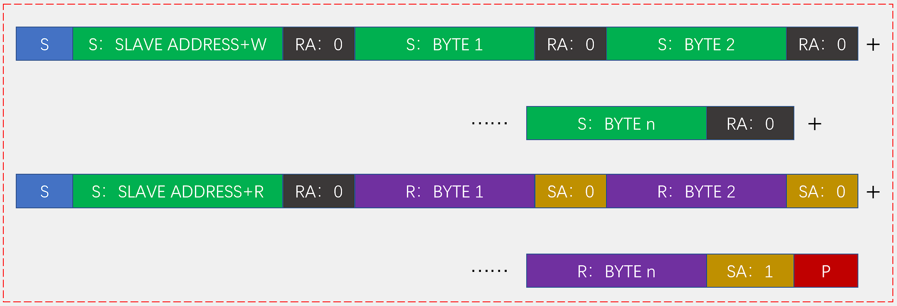

  完成任务：向谁收指定的什么

## 11.5 I2C 时序

指定地址写

对于指定设备（Slave Address），在指定地址（Reg Address）下，写入指定数据（Data）


当前地址读

对于指定设备（Slave Address），在当前地址指针指示的地址下，读取从机数据（Data）


指定地址读

对于指定设备（Slave Address），在指定地址（Reg Address）下，读取从机数据（Data）


## 11.6 I2C 外设简介

STM32 内部集成了硬件 I2C 收发电路，可以由硬件自动执行时钟生成、起始终止条件生成、应答位收发、数据收发等功能，减轻 CPU 的负担

支持多主机模型

支持 7 位/10 位地址模式

支持不同的通讯速度，标准速度(高达 100 kHz)，快速(高达 400 kHz)

支持 DMA

兼容 SMBus 协议

STM32F103C8T6 硬件 I2C 资源：I2C1、I2C2

## 11.7 I2C 框图

《STM32F10xxx 参考手册\_10_zh》 P495 图 242 I2C 的功能框图

## 11.8 I2C 基本结构


## 11.9 主机发送

《STM32F10xxx 参考手册\_10_zh》 P498 图 245 主发送器传送序列图

## 11.10 主机接收

《STM32F10xxx 参考手册\_10_zh》 P499 图 246 主接收器传送序列图

## 11.11 软/硬件波形对比


# 第 12 章 SPI 通信

## 12.1 简介

SPI（Serial Peripheral Interface）是由 Motorola 公司开发的一种通用数据总线

四根通信线：SCK（Serial Clock）、MOSI（Master Output Slave Input）、MISO（Master Input Slave Output）、SS（Slave Select）

同步，全双工

支持总线挂载多设备（一主多从）


## 12.2 硬件电路

所有 SPI 设备的 SCK、MOSI、MISO 分别连在一起

主机另外引出多条 SS 控制线，分别接到各从机的 SS 引脚

输出引脚配置为推挽输出，输入引脚配置为浮空或上拉输入


## 12.3 移位示意图


## 12.4 SPI 时序基本单元

起始条件：SS 从高电平切换到低电平

终止条件：SS 从低电平切换到高电平


交换一个字节（模式 0）

CPOL=0：空闲状态时，SCK 为低电平

CPHA=0：SCK 第一个边沿移入数据，第二个边沿移出数据

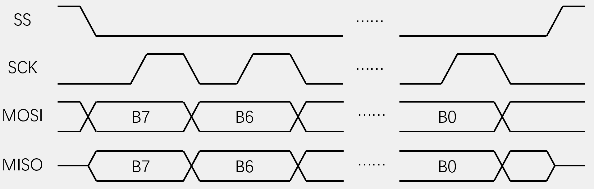

交换一个字节（模式 1）

CPOL=0：空闲状态时，SCK 为低电平

CPHA=1：SCK 第一个边沿移出数据，第二个边沿移入数据

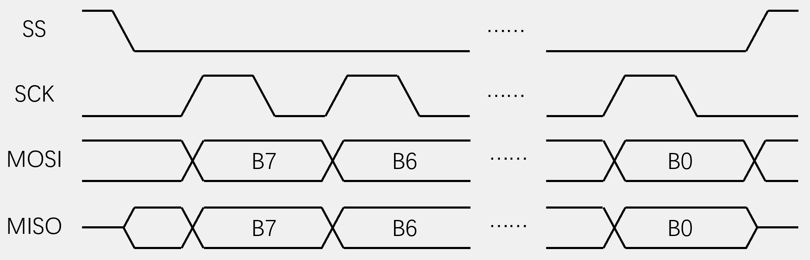

交换一个字节（模式 2）

CPOL=1：空闲状态时，SCK 为高电平

CPHA=0：SCK 第一个边沿移入数据，第二个边沿移出数据

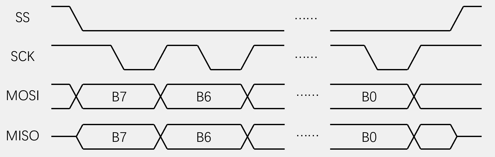

交换一个字节（模式 3）

CPOL=1：空闲状态时，SCK 为高电平

CPHA=1：SCK 第一个边沿移出数据，第二个边沿移入数据

## 12.5 SPI 时序

发送指令

向 SS 指定的设备，发送指令（0x06）


指定地址写

向 SS 指定的设备，发送写指令（0x02），

 随后在指定地址（Address[23:0]）下，写入指定数据（Data）


指定地址读

向 SS 指定的设备，发送读指令（0x03），

 随后在指定地址（Address[23:0]）下，读取从机数据（Data）


## 12.6 SPI 外设简介

STM32 内部集成了硬件 SPI 收发电路，可以由硬件自动执行时钟生成、数据收发等功能，减轻 CPU 的负担

可配置 8 位/16 位数据帧、高位先行/低位先行

时钟频率： fPCLK / (2, 4, 8, 16, 32, 64, 128, 256)

支持多主机模型、主或从操作

可精简为半双工/单工通信

支持 DMA

兼容 I2S 协议

STM32F103C8T6 硬件 SPI 资源：SPI1、SPI2

## 12.7 SPI 框图

《STM32F10xxx 参考手册\_10_zh》 P459 图 209 SPI 框图

## 12.8 SPI 基本结构

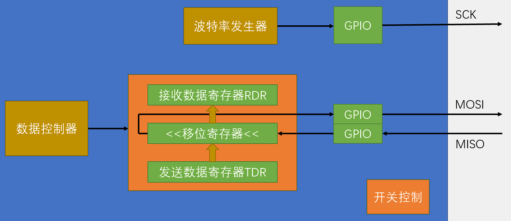

## 12.9 主模式全双工连续传输

《STM32F10xxx 参考手册\_10_zh》 P465 图 213 主模式、全双工模式下 (BIDIMODE = 0 并且 RXONLY = 0) 连续传输时，TXE/RXNE/BSY 的变化示意图

## 12.10 非连续传输

《STM32F10xxx 参考手册\_10_zh》 P468 图 218 非连续传输发送 (BIDIMODE = 0 并且 RXONLY = 0) 时，TXE/BSY 变化示意图

## 12.11 软/硬件波形对比


# 第 13 章 RTC 实时时钟 BKP 备份寄存器

## 13.1 Unix 时间戳

Unix 时间戳（Unix Timestamp）定义为从 UTC/GMT 的 1970 年 1 月 1 日 0 时 0 分 0 秒开始所经过的秒数，不考虑闰秒

时间戳存储在一个秒计数器中，秒计数器为 32 位/64 位的整型变量

世界上所有时区的秒计数器相同，不同时区通过添加偏移来得到当地时间

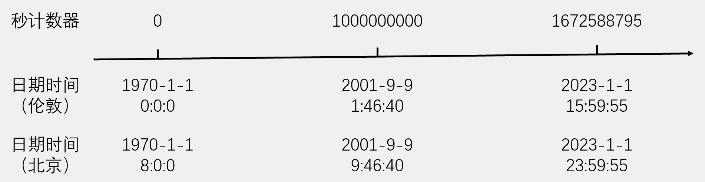

## 13.2 UTC/GMT

GMT（Greenwich Mean Time）格林尼治标准时间是一种以地球自转为基础的时间计量系统。它将地球自转一周的时间间隔等分为 24 小时，以此确定计时标准

UTC（Universal Time Coordinated）协调世界时是一种以原子钟为基础的时间计量系统。它规定铯 133 原子基态的两个超精细能级间在零磁场下跃迁辐射 9,192,631,770 周所持续的时间为 1 秒。当原子钟计时一天的时间与地球自转一周的时间相差超过 0.9 秒时，UTC 会执行闰秒来保证其计时与地球自转的协调一致

## 13.3 时间戳转换

C 语言的 time.h 模块提供了时间获取和时间戳转换的相关函数，可以方便地进行秒计数器、日期时间和字符串之间的转换

| 函数                                                            | 作用                                   |
| --------------------------------------------------------------- | -------------------------------------- |
| time_t time(time_t\*);                                          | 获取系统时钟                           |
| struct tm* gmtime(const time_t*);                               | 秒计数器转换为日期时间（格林尼治时间） |
| struct tm* localtime(const time_t*);                            | 秒计数器转换为日期时间（当地时间）     |
| time_t mktime(struct tm\*);                                     | 日期时间转换为秒计数器（当地时间）     |
| char* ctime(const time_t*);                                     | 秒计数器转换为字符串（默认格式）       |
| char* asctimeconst struct tm*);                                 | 日期时间转换为字符串（默认格式）       |
| size_t strftime(char*, size_t, const char*, const struct tm\*); | 日期时间转换为字符串（自定义格式）     |

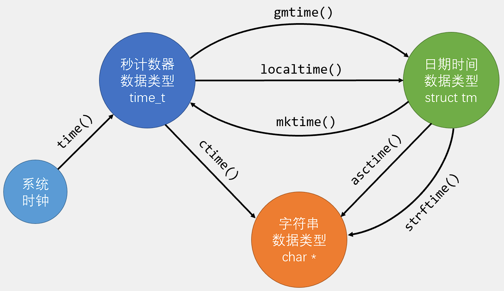

## BKP 备份寄存器 简介

BKP（Backup Registers）备份寄存器

BKP 可用于存储用户应用程序数据。当 VDD（2.0~3.6V）电源被切断，他们仍然由 VBAT（1.8~3.6V）维持供电。当系统在待机模式下被唤醒，或系统复位或电源复位时，他们也不会被复位

TAMPER 引脚产生的侵入事件将所有备份寄存器内容清除

RTC 引脚输出 RTC 校准时钟、RTC 闹钟脉冲或者秒脉冲

存储 RTC 时钟校准寄存器

用户数据存储容量：

 20 字节（中容量和小容量）/ 84 字节（大容量和互联型）

## BKP 基本结构


## RTC 简介

RTC（Real Time Clock）实时时钟

RTC 是一个独立的定时器，可为系统提供时钟和日历的功能

RTC 和时钟配置系统处于后备区域，系统复位时数据不清零，VDD（2.0~3.6V）断电后可借助 VBAT（1.8~3.6V）供电继续走时

32 位的可编程计数器，可对应 Unix 时间戳的秒计数器

20 位的可编程预分频器，可适配不同频率的输入时钟

可选择三种 RTC 时钟源：

 HSE 时钟除以 128（通常为 8MHz/128）

 LSE 振荡器时钟（通常为 32.768KHz）

 LSI 振荡器时钟（40KHz）

## RTC 框图

《STM32F10xxx 参考手册\_10_zh》 P309 图 154 简化的 RTC 框图

## RTC 基本结构

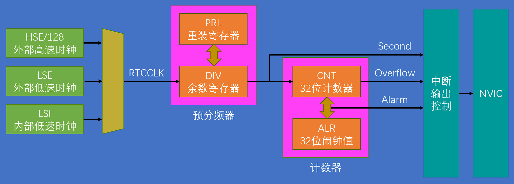

## 硬件电路


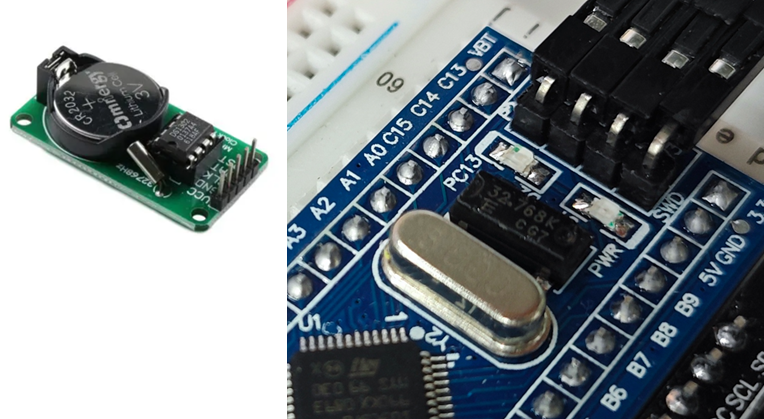

## RTC 操作注意事项

执行以下操作将使能对 BKP 和 RTC 的访问：

 设置 RCC_APB1ENR 的 PWREN 和 BKPEN，使能 PWR 和 BKP 时钟

 设置 PWR_CR 的 DBP，使能对 BKP 和 RTC 的访问

若在读取 RTC 寄存器时，RTC 的 APB1 接口曾经处于禁止状态，则软件首先必须等待 RTC_CRL 寄存器中的 RSF 位（寄存器同步标志）被硬件置 1

必须设置 RTC_CRL 寄存器中的 CNF 位，使 RTC 进入配置模式后，才能写入 RTC_PRL、RTC_CNT、RTC_ALR 寄存器

对 RTC 任何寄存器的写操作，都必须在前一次写操作结束后进行。可以通过查询 RTC_CR 寄存器中的 RTOFF 状态位，判断 RTC 寄存器是否处于更新中。仅当 RTOFF 状态位是 1 时，才可以写入 RTC 寄存器

# 第 14 章 PWR 电源控制

## PWR 简介

PWR（Power Control）电源控制

PWR 负责管理 STM32 内部的电源供电部分，可以实现可编程电压监测器和低功耗模式的功能

可编程电压监测器（PVD）可以监控 VDD 电源电压，当 VDD 下降到 PVD 阀值以下或上升到 PVD 阀值之上时，PVD 会触发中断，用于执行紧急关闭任务

低功耗模式包括睡眠模式（Sleep）、停机模式（Stop）和待机模式（Standby），可在系统空闲时，降低 STM32 的功耗，延长设备使用时间

## 电源框图

《STM32F10xxx 参考手册\_10_zh》 P37 图 4 电源框图

## 上电复位和掉电复位

《STM32F10xxx 参考手册\_10_zh》 P39 图 5 上电复位和掉电复位的波形图

## 可编程电压检测器

《STM32F10xxx 参考手册\_10_zh》 P39 图 6 PVD 的门限

## 低功耗模式

《STM32F10xxx 参考手册\_10_zh》 P40 表 8 低功耗模式一览

## 模式选择

执行 WFI（Wait For Interrupt）或者 WFE（Wait For Event）指令后，STM32 进入低功耗模式

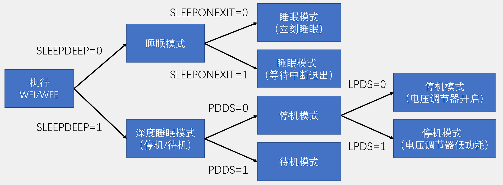

## 睡眠模式

执行完 WFI/WFE 指令后，STM32 进入睡眠模式，程序暂停运行，唤醒后程序从暂停的地方继续运行

SLEEPONEXIT 位决定 STM32 执行完 WFI 或 WFE 后，是立刻进入睡眠，还是等 STM32 从最低优先级的中断处理程序中退出时进入睡眠

在睡眠模式下，所有的 I/O 引脚都保持它们在运行模式时的状态

WFI 指令进入睡眠模式，可被任意一个 NVIC 响应的中断唤醒

WFE 指令进入睡眠模式，可被唤醒事件唤醒

## 停止模式

执行完 WFI/WFE 指令后，STM32 进入停止模式，程序暂停运行，唤醒后程序从暂停的地方继续运行

1.8V 供电区域的所有时钟都被停止，PLL、HSI 和 HSE 被禁止，SRAM 和寄存器内容被保留下来

在停止模式下，所有的 I/O 引脚都保持它们在运行模式时的状态

当一个中断或唤醒事件导致退出停止模式时，HSI 被选为系统时钟

当电压调节器处于低功耗模式下，系统从停止模式退出时，会有一段额外的启动延时

WFI 指令进入停止模式，可被任意一个 EXTI 中断唤醒

WFE 指令进入停止模式，可被任意一个 EXTI 事件唤醒

## 待机模式

执行完 WFI/WFE 指令后，STM32 进入待机模式，唤醒后程序从头开始运行

整个 1.8V 供电区域被断电，PLL、HSI 和 HSE 也被断电，SRAM 和寄存器内容丢失，只有备份的寄存器和待机电路维持供电

在待机模式下，所有的 I/O 引脚变为高阻态（浮空输入）

WKUP 引脚的上升沿、RTC 闹钟事件的上升沿、NRST 引脚上外部复位、IWDG 复位退出待机模式

# 第 15 章 WDG 看门狗

## WDG 简介

WDG（Watchdog）看门狗

看门狗可以监控程序的运行状态，当程序因为设计漏洞、硬件故障、电磁干扰等原因，出现卡死或跑飞现象时，看门狗能及时复位程序，避免程序陷入长时间的罢工状态，保证系统的可靠性和安全性

看门狗本质上是一个定时器，当指定时间范围内，程序没有执行喂狗（重置计数器）操作时，看门狗硬件电路就自动产生复位信号

STM32 内置两个看门狗

 独立看门狗（IWDG）：独立工作，对时间精度要求较低

 窗口看门狗（WWDG）：要求看门狗在精确计时窗口起作用

## IWDG 框图

《STM32F10xxx 参考手册\_10_zh》 P317 图 157 独立看门狗框图

## IWDG 键寄存器

键寄存器本质上是控制寄存器，用于控制硬件电路的工作

在可能存在干扰的情况下，一般通过在整个键寄存器写入特定值来代替控制寄存器写入一位的功能，以降低硬件电路受到干扰的概率

| 写入键寄存器的值    | 作用                                    |
| ------------------- | --------------------------------------- |
| 0xCCCC              | 启用独立看门狗                          |
| 0xAAAA              | IWDG_RLR 中的值重新加载到计数器（喂狗） |
| 0x5555              | 解除 IWDG_PR 和 IWDG_RLR 的写保护       |
| 0x5555 之外的其他值 | 启用 IWDG_PR 和 IWDG_RLR 的写保护       |

## IWDG 超时时间

超时时间：$T_{IWDG} = T_{LSI} \times PR预分频系数 \times (RL + 1)$

其中：$T_{LSI} = 1 / F_{LSI}$

《STM32F10xxx 参考手册\_10_zh》 P317 表 83 看门狗超时时间 (40KHz 的输入时钟 (LSI) )

## WWDG 框图

《STM32F10xxx 参考手册\_10_zh》 P320 图 158 看门狗框图

## WWDG 工作特性

递减计数器 T[6:0]的值小于 0x40 时，WWDG 产生复位

递减计数器 T[6:0]在窗口 W[6:0]外被重新装载时，WWDG 产生复位

递减计数器 T[6:0]等于 0x40 时可以产生早期唤醒中断（EWI），用于重装载计数器以避免 WWDG 复位

定期写入 WWDG_CR 寄存器（喂狗）以避免 WWDG 复位

超时时间：

 $T_{WWDG} = T_{PCLK1} \times 4096 \times WDGTB预分频系数 \times (T[5:0] + 1)$

窗口时间：

 $T_{WIN} = T_{PCLK1} \times 4096 \times WDGTB预分频系数 \times (T[5:0] - W[5:0])$

其中：$T_{PCLK1} = 1 / F_{PCLK1}$

《STM32F10xxx 参考手册\_10_zh》 P321 图 159 窗口看门狗时序图

## IWDG 和 WWDG 对比

|            | IWDG 独立看门狗              | WWDG 窗口看门狗                        |
| ---------- | ---------------------------- | -------------------------------------- |
| 复位       | 计数器减到 0 后              | 计数器 T[5:0]减到 0 后、过早重装计数器 |
| 中断       | 无                           | 早期唤醒中断                           |
| 时钟源     | LSI（40KHz）                 | PCLK1（36MHz）                         |
| 预分频系数 | 4、8、32、64、128、256       | 1、2、4、8                             |
| 计数器     | 12 位                        | 6 位（有效计数）                       |
| 超时时间   | 0.1ms~26214.4ms              | 113us~58.25ms                          |
| 喂狗方式   | 写入键寄存器，重装固定值 RLR | 直接写入计数器，写多少重装多少         |
| 防误操作   | 键寄存器和写保护             | 无                                     |
| 用途       | 独立工作，对时间精度要求较低 | 要求看门狗在精确计时窗口起作用         |

# 第 16 章 FLASH 闪存

## FLASH 简介

STM32F1 系列的 FLASH 包含程序存储器、系统存储器和选项字节三个部分，通过闪存存储器接口（外设）可以对程序存储器和选项字节进行擦除和编程

读写 FLASH 的用途：

 利用程序存储器的剩余空间来保存掉电不丢失的用户数据

 通过在程序中编程（IAP），实现程序的自我更新

在线编程（In-Circuit Programming – ICP）用于更新程序存储器的全部内容，它通过 JTAG、SWD 协议或系统加载程序（Bootloader）下载程序

在程序中编程（In-Application Programming – IAP）可以使用微控制器支持的任一种通信接口下载程序

## 闪存模块组织

《STM32F10xxx 参考手册\_10_zh》 P30 表 2 闪存模块的组织（小容量产品）

## FLASH 基本结构

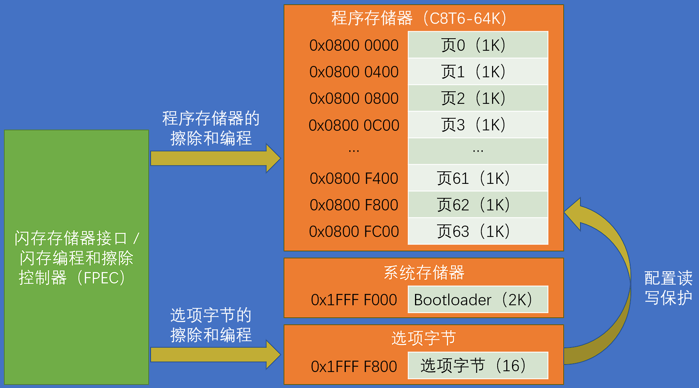

## FLASH 解锁

FPEC 共有三个键值：

 RDPRT 键 = 0x000000A5

 KEY1 = 0x45670123

 KEY2 = 0xCDEF89AB

解锁：

 复位后，FPEC 被保护，不能写入 FLASH_CR

 在 FLASH_KEYR 先写入 KEY1，再写入 KEY2，解锁

 错误的操作序列会在下次复位前锁死 FPEC 和 FLASH_CR

加锁：

 设置 FLASH_CR 中的 LOCK 位锁住 FPEC 和 FLASH_CR

## 使用指针访问存储器

使用指针读指定地址下的存储器：

 uint16*t Data = *((\_\_IO uint16*t *)(0x08000000));

使用指针写指定地址下的存储器：

 _((\_\_IO uint16_t _)(0x08000000)) = 0x1234;

其中：

 #define \_\_IO volatile

## 程序存储器编程

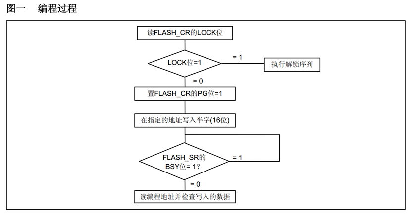

## 程序存储器页擦除

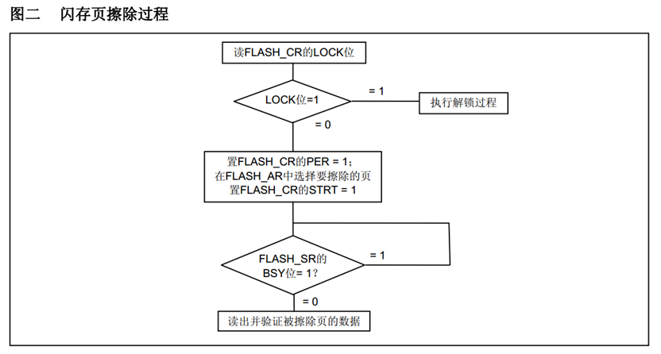

## 程序存储器全擦除

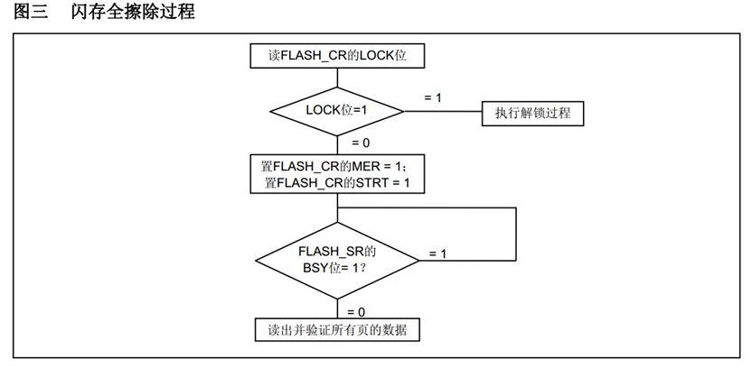

## 选项字节

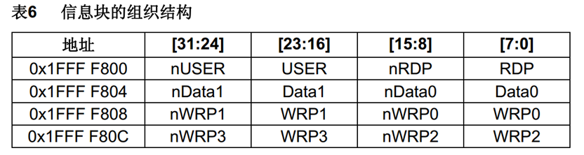

RDP：写入 RDPRT 键（0x000000A5）后解除读保护

USER：配置硬件看门狗和进入停机/待机模式是否产生复位

Data0/1：用户可自定义使用

WRP0/1/2/3：配置写保护，每一个位对应保护 4 个存储页（中容量）

## 选项字节编程

检查 FLASH_SR 的 BSY 位，以确认没有其他正在进行的编程操作

解锁 FLASH_CR 的 OPTWRE 位

设置 FLASH_CR 的 OPTPG 位为 1

写入要编程的半字到指定的地址

等待 BSY 位变为 0

读出写入的地址并验证数据

## 选项字节擦除

检查 FLASH_SR 的 BSY 位，以确认没有其他正在进行的闪存操作

解锁 FLASH_CR 的 OPTWRE 位

设置 FLASH_CR 的 OPTER 位为 1

设置 FLASH_CR 的 STRT 位为 1

等待 BSY 位变为 0

读出被擦除的选择字节并做验证

## 器件电子签名

电子签名存放在闪存存储器模块的系统存储区域，包含的芯片识别信息在出厂时编写，不可更改，使用指针读指定地址下的存储器可获取电子签名

闪存容量寄存器：

基地址：0x1FFF F7E0

大小：16 位

产品唯一身份标识寄存器：

基地址： 0x1FFF F7E8

大小：96 位

